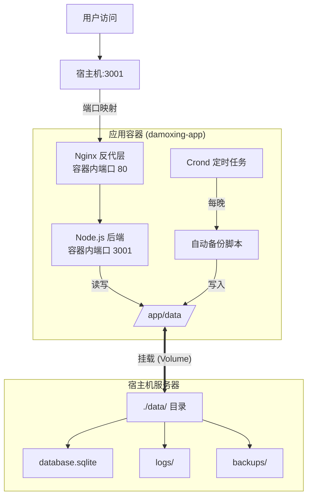

# 📦 运维部署手册

本文档是大模型项目的完整部署与运维指南，面向现场运维人员，涵盖离线/内网环境的 Docker 部署方案、日常运维和故障排查。

> **文档版本**: v2.1.0  
> **最后更新**: 2026-01-23

---

## 📑 目录

### 第一部分：部署（必须执行）
- [1. 环境要求与架构说明](#-1-环境要求与架构说明)
- [2. 部署步骤](#-2-部署步骤)
- [3. 安全配置](#-3-安全配置)

### 第二部分：日常运维（参考）
- [4. 容器管理](#-4-容器管理)
- [5. 备份与恢复](#-5-备份与恢复)
- [6. 监控与健康检查](#-6-监控与健康检查)
- [7. 更新与升级](#-7-更新与升级)

### 第三部分：故障排查（参考）
- [8. 故障诊断指南](#-8-故障诊断指南)

---

# 第一部分：部署（必须执行）

---

## 🏗️ 1. 环境要求与架构说明

### 1.1 服务器要求

| 项目 | 最低配置 | 推荐配置 |
|------|----------|----------|
| **操作系统** | Linux (Ubuntu 20.04+ / CentOS 7+) | Ubuntu 22.04 LTS |
| **信创操作系统** | 麒麟 V10 / 统信 UOS V20 | 麒麟 V10 SP1 / 统信 UOS V20 |
| **Docker** | >= 20.10.x | >= 24.x |
| **Docker Compose** | >= 1.29.x | >= 2.x |
| **内存** | 2GB | 4GB+ |
| **磁盘** | 10GB 可用空间 | 20GB+ SSD |

### 1.2 架构支持检查

在开始部署前，请确认服务器的 CPU 架构：

```bash
uname -m
```

| 输出结果 | 架构名称 | 说明 | 适配镜像/文件后缀 |
|----------|----------|------|-------------------|
| `x86_64` | **AMD64** | 绝大多数 PC 和服务器 | `x86_64` 或 `amd64` |
| `aarch64` | **ARM64** | 国产信创服务器（鲲鹏/飞腾）、Mac M系列 | `aarch64` 或 `arm64` |

> ⚠️ **注意**: 请确保下载的 Docker 二进制包和镜像与服务器架构完全匹配。

### 1.3 网络要求

本项目需要满足以下网络条件：

**1. 对外服务端口**

容器通过宿主机端口对外提供服务，默认使用 `3001` 端口（可根据实际情况调整，避免与现有服务冲突）。

| 端口 | 用途 | 说明 |
|------|------|------|
| 3001 | 应用服务端口 | 需在防火墙中开放，供用户访问 |

**2. 外部服务依赖**

应用需要访问 Dify AI 服务，请确保网络可达：

| 服务 | 地址 | 说明 |
|------|------|------|
| Dify AI | `https://appcs.jbysoft.com` | 公司 Dify 服务地址，或使用内网部署的 Dify |

> **提示**: 如果有外部 Nginx 反代，仅需开放 Nginx 监听端口（如 80/443），3001 端口可只在内网访问。

### 1.4 架构与访问流程

本项目采用**单目录挂载**的优化架构，所有持久化数据集中存储：



> **访问流程**: 用户 → 宿主机:3001 → 容器 Nginx:80 → Node.js:3001

---

## 🔒 2. 部署步骤

### 2.1 获取离线安装包

在有网络的机器上准备：

1. **Docker Engine**: 访问 [Docker 官方离线包](https://download.docker.com/linux/static/stable/)，下载对应架构的 `.tgz` 包
2. **Docker Compose**: 访问 [GitHub Releases](https://github.com/docker/compose/releases)，下载对应架构的二进制文件
3. **项目镜像**: 导出 Docker 镜像为 `.tar` 文件

### 2.2 安装 Docker 引擎

```bash
# 1. 解压安装包
tar -xvf /tmp/docker-*.tgz -C /tmp

# 2. 移入系统路径
sudo cp /tmp/docker/* /usr/bin/

# 3. 配置 Systemd 服务
sudo cat > /etc/systemd/system/docker.service <<EOF
[Unit]
Description=Docker Application Container Engine
Documentation=https://docs.docker.com
After=network-online.target firewalld.service
Wants=network-online.target

[Service]
Type=notify
ExecStart=/usr/bin/dockerd
ExecReload=/bin/kill -s HUP \$MAINPID
LimitNOFILE=infinity
LimitNPROC=infinity
TimeoutStartSec=0
Delegate=yes
KillMode=process
Restart=on-failure
StartLimitBurst=3
StartLimitInterval=60s

[Install]
WantedBy=multi-user.target
EOF

# 4. 启动服务
sudo systemctl daemon-reload
sudo systemctl start docker
sudo systemctl enable docker

# 5. 验证安装
docker --version
```

### 2.3 安装 Docker Compose

```bash
# 1. 移动并重命名
sudo cp /tmp/docker-compose-linux-$(uname -m) /usr/local/bin/docker-compose

# 2. 赋予执行权限
sudo chmod +x /usr/local/bin/docker-compose

# 3. 验证
docker-compose --version
```

> **信创系统特殊说明 (麒麟/统信)**:
> 
> 麒麟 V10 和统信 UOS 系统使用上述离线安装方式通常可以正常工作。如遇问题：
> - **Docker 启动失败**: 检查内核版本 (`uname -r`)，需 >= 3.10
> - **权限问题**: 部分信创系统需要手动将用户加入 docker 组：
>   ```bash
>   sudo groupadd docker
>   sudo usermod -aG docker $USER
>   newgrp docker
>   ```
> - **SELinux 问题**: 如遇权限拒绝，临时关闭 SELinux 测试：
>   ```bash
>   sudo setenforce 0
>   ```

### 2.4 准备项目文件

将交付包上传至服务器，标准目录结构如下：

```text
~/damoxing/
├── damoxing.tar           # 离线镜像包 (约 500MB-1GB)
├── docker-compose.yml     # 编排文件
├── .env                   # 配置文件
└── data/                  # [重要] 唯一的数据目录
    └── database.sqlite    # 初始数据库文件 (约 10MB)
```

**交付包验收检查**：

```bash
# 进入项目目录
cd ~/damoxing

# 1. 检查文件完整性
ls -la
# 应看到: damoxing.tar, docker-compose.yml, .env, data/

# 2. 检查镜像包大小 (应 > 100MB)
ls -lh damoxing.tar

# 3. 检查数据库文件存在
ls -la data/database.sqlite

# 4. 检查 docker-compose.yml 存在
cat docker-compose.yml

# 5. 检查配置文件可读
cat .env
```

> ⚠️ 如有文件缺失或损坏，请联系交付人员获取完整交付包。

### 2.5 导入离线镜像

```bash
# 导入镜像
docker load -i damoxing.tar

# 验证 (确保看到 damoxing-app 镜像)
docker images
```

### 2.6 docker-compose.yml 配置说明

以下是 `docker-compose.yml` 的完整配置及说明，运维人员可根据现场环境调整：

```yaml
version: '3.8'

services:
  app:
    # 镜像名称 (与导入的 damoxing.tar 一致)
    image: damoxing-app:latest
    container_name: damoxing-app
    restart: unless-stopped

    # ============================================
    # 端口映射: 宿主机端口:容器端口
    # ============================================
    # 可根据现场情况修改宿主机端口 (冒号左边)
    ports:
      - "3001:80"

    # ============================================
    # 网络配置
    # ============================================
    networks:
      - damoxing-net

    # ============================================
    # 环境变量配置
    # ============================================
    environment:
      - NODE_ENV=production
      - DB_PATH=/app/data/database.sqlite
      - LOG_DIR=/app/data/logs
      
      # CORS 跨域白名单 (多个域名用逗号分隔)
      - CORS_ORIGIN=https://your-domain.com
      
      # API 路由前缀 (根据实际部署路径调整)
      - API_ROUTE_PREFIX=/gjjrgzn/api
      
      # JWT 配置 (务必修改 JWT_SECRET)
      - JWT_SECRET=your-jwt-secret-change-this
      
      # 第三方网关配置 (如有)
      - GATEWAY_VALIDATE_URL=https://your-gateway/validate # 需要与贝贝网关的地址保持一致 https://appcs.jbysoft.com/tyrz/cheque/validate.service(网关平台测试环境地址)
      - GATEWAY_ENABLED=true
      - SKIP_LOCAL_AUTH=true

    # ============================================
    # 数据目录挂载
    # ============================================
    # 宿主机 ./data 目录挂载到容器内 /app/data
    # 包含: database.sqlite, logs/, backups/
    volumes:
      - ./data:/app/data

    # ============================================
    # 健康检查配置
    # ============================================
    healthcheck:
      test: ["CMD", "wget", "--quiet", "--tries=1", "--spider", "http://127.0.0.1/health"]
      interval: 30s      # 检查间隔
      timeout: 3s        # 超时时间
      retries: 3         # 失败重试次数
      start_period: 10s  # 启动等待时间

# ============================================
# 网络配置
# ============================================
# 使用自定义网段，避免与宿主机网络冲突
networks:
  damoxing-net:
    driver: bridge
    ipam:
      driver: default
      config:
        - subnet: 172.28.0.0/16
          gateway: 172.28.0.1
```

**关键配置说明**:

| 配置项 | 说明 | 是否需要修改 |
|--------|------|--------------|
| `ports` | 宿主机端口映射，如 `3001:80` 表示宿主机3001映射到容器80 | 根据需要 |
| `CORS_ORIGIN` | 跨域白名单，多个域名用逗号分隔 | ✅ 必须修改 |
| `JWT_SECRET` | JWT 签名密钥 | ✅ 必须修改 |
| `API_ROUTE_PREFIX` | API 路由前缀，需与外部 Nginx 配置一致 | 根据需要 |
| `GATEWAY_ENABLED` | 是否启用第三方网关验证 | 根据需要 |
| `subnet` | 容器网络网段，如与宿主机冲突需修改 | 根据需要 |

> ⚠️ **注意**: 环境变量配置有两种方式，**二选一**即可：
> - **方式一**: 直接在 `docker-compose.yml` 的 `environment` 中配置（如上所示）
> - **方式二**: 使用独立的 `.env` 文件配置（见 2.7 节）
> 
> **优先级**: 如果两者都配置了同一个变量，`docker-compose.yml` 中的 `environment` 优先级更高。
> 
> **推荐做法**: 
> - 将 `docker-compose.yml` 中的 `environment` 部分**删除或注释掉**
> - 使用 `.env` 文件管理所有环境变量，便于保密和维护

如果选择**方式一**（直接在 docker-compose.yml 中配置），请按以下步骤修改：

1. 打开 `docker-compose.yml` 文件
2. 找到 `environment` 部分
3. 根据实际情况修改各配置项的值
4. 保存文件

### 2.7 修改配置（使用 .env 文件）

如果选择**方式二**（使用 .env 文件，推荐），请按以下步骤：

1. 确保 `docker-compose.yml` 中的 `environment` 部分已删除或注释，修改后如下：

```yaml
version: '3.8'

services:
  app:
    image: damoxing-app:latest
    container_name: damoxing-app
    restart: unless-stopped
    ports:
      - "3001:80"
    networks:
      - damoxing-net
    # 使用 .env 文件配置环境变量，无需在此处配置 environment
    env_file:
      - .env
    volumes:
      - ./data:/app/data
    healthcheck:
      test: ["CMD", "wget", "--quiet", "--tries=1", "--spider", "http://127.0.0.1/health"]
      interval: 30s
      timeout: 3s
      retries: 3
      start_period: 10s

networks:
  damoxing-net:
    driver: bridge
    ipam:
      driver: default
      config:
        - subnet: 172.28.0.0/16
          gateway: 172.28.0.1
```

2. 编辑 `.env` 文件：

```ini
# 基础配置
NODE_ENV=production
DB_PATH=/app/data/database.sqlite
LOG_DIR=/app/data/logs

# 接口前缀 (例如 /gjjrgzn/api)
API_ROUTE_PREFIX=/gjjrgzn/api

# 跨域白名单 (生产环境必须指定具体域名)
CORS_ORIGIN=https://your-domain.com

# 安全密钥 (务必修改为随机字符串)
# 生成方式: openssl rand -hex 32
JWT_SECRET=Change_This_To_A_Random_Secret

# 第三方网关配置
GATEWAY_VALIDATE_URL=https://appcs.jbysoft.com/tyrz/cheque/validate.service
GATEWAY_ENABLED=true
SKIP_LOCAL_AUTH=true
```

### 2.8 启动服务

```bash
# 进入项目目录
cd ~/damoxing

# 启动
docker-compose up -d

# 查看状态 (应显示 Up (healthy))
docker-compose ps

# 验证服务
curl http://localhost:3001/health
```

---

## 🛡️ 3. 安全配置

> ⚠️ **重要**: 本章内容必须在部署后立即执行！

### 3.1 必须执行的安全配置

| 序号 | 项目 | 操作 | 说明 |
|------|------|------|------|
| 1 | **修改 JWT 密钥** | 编辑 `.env`，使用 `openssl rand -hex 32` 生成 | 默认密钥不安全 |
| 2 | **配置 CORS** | 编辑 `.env`，指定具体域名，不使用 `*` | 防止跨域攻击 |
| 3 | **配置防火墙** | 见下方示例 | 仅开放必要端口 |

### 3.2 防火墙配置

**Ubuntu (ufw)**:
```bash
# 开放 3001 端口
sudo ufw allow 3001/tcp

# 如有外部 Nginx，开放 80/443
sudo ufw allow 80/tcp
sudo ufw allow 443/tcp

# 启用防火墙
sudo ufw enable

# 查看规则
sudo ufw status
```

**CentOS / 麒麟 / 统信 (firewalld)**:
```bash
# 开放 3001 端口
sudo firewall-cmd --permanent --add-port=3001/tcp
sudo firewall-cmd --reload

# 查看规则
sudo firewall-cmd --list-all
```

**部分统信 UOS (iptables)**:

如果系统使用 iptables 而非 firewalld（可通过 `systemctl status firewalld` 检查），使用以下命令：

```bash
# 开放 3001 端口
sudo iptables -A INPUT -p tcp --dport 3001 -j ACCEPT

# 如有外部 Nginx，开放 80/443
sudo iptables -A INPUT -p tcp --dport 80 -j ACCEPT
sudo iptables -A INPUT -p tcp --dport 443 -j ACCEPT

# 保存规则 (重启后生效)
sudo iptables-save > /etc/iptables.rules

# 设置开机加载 (添加到 /etc/rc.local)
echo "iptables-restore < /etc/iptables.rules" >> /etc/rc.local
```

### 3.3 其他安全建议

| 建议 | 说明 |
|------|------|
| **使用 HTTPS** | 通过外部 Nginx 配置 SSL 证书 |
| **定期备份** | 确保自动备份正常运行 |
| **异地备份** | 防止服务器硬件故障 |
| **监控日志** | 定期检查错误日志 |
| **最小权限** | 数据目录使用最小必要权限 |

---

# 第二部分：日常运维（参考）

---

## 🐳 4. 容器管理

### 4.1 常用命令

```bash
# 启动服务
docker-compose up -d

# 查看日志
docker-compose logs -f

# 查看最近 100 行日志
docker-compose logs --tail 100

# 停止服务
docker-compose down

# 重启服务
docker-compose restart

# 查看容器状态
docker-compose ps

# 进入容器
docker exec -it damoxing-app /bin/sh
```

### 4.2 容器资源查看

```bash
# 查看容器资源使用
docker stats damoxing-app

# 查看容器详情
docker inspect damoxing-app

# 查看容器日志路径
docker inspect --format='{{.LogPath}}' damoxing-app
```

### 4.3 镜像管理

```bash
# 查看本地镜像
docker images

# 导出镜像 (用于备份或分发)
docker save -o damoxing-backup.tar damoxing-app:latest

# 删除无用镜像 (清理磁盘)
docker image prune -a
```

---

## 🔄 5. 备份与恢复

### 5.1 自动化备份机制

容器内置了 `crond` 服务和备份脚本，默认策略：

| 项目 | 配置 |
|------|------|
| **执行时间** | 每天凌晨 02:00 |
| **备份路径** | `./data/backups/` |
| **保留策略** | 自动保留最近 7 天 |
| **实现原理** | SQLite 在线备份 (`.backup`)，不锁表 |

**手动触发备份**:
```bash
docker exec damoxing-app /app/backup-db.sh
```

**查看备份文件**:
```bash
ls -la ./data/backups/
```

### 5.2 手动备份脚本 (可选)

如需额外的备份策略，创建 `backup.sh`:

```bash
#!/bin/bash
DATE=$(date +%Y%m%d_%H%M%S)
BACKUP_DIR="~/damoxing/data/backups"
DB_PATH="~/damoxing/data/database.sqlite"

mkdir -p $BACKUP_DIR
cp $DB_PATH $BACKUP_DIR/database_$DATE.sqlite

# 保留最近 7 天的备份
find $BACKUP_DIR -name "database_*.sqlite" -mtime +7 -delete

echo "备份完成: database_$DATE.sqlite"
```

添加到 crontab（每天凌晨 2 点备份）:
```bash
chmod +x ~/damoxing/backup.sh
crontab -e
# 添加: 0 2 * * * ~/damoxing/backup.sh
```

### 5.3 数据恢复

**恢复步骤**:

1. **停止服务**:
   ```bash
   docker-compose down
   ```

2. **检查备份完整性**:
   ```bash
   sqlite3 data/backups/database_20260123_020000.sqlite "PRAGMA integrity_check"
   ```

3. **替换数据库文件**:
   ```bash
   cp data/backups/database_20260123_020000.sqlite data/database.sqlite
   ```

4. **重启服务**:
   ```bash
   docker-compose up -d
   ```

5. **验证恢复结果**:
   ```bash
   curl http://localhost:3001/health
   ```

### 5.4 异地备份建议

为防止服务器故障导致数据丢失，建议配置异地备份：

```bash
# 使用 rsync 同步到远程服务器
rsync -avz ~/damoxing/data/backups/ user@backup-server:/backups/damoxing/

# 添加到 crontab (每天凌晨 3 点同步)
0 3 * * * rsync -avz ~/damoxing/data/backups/ user@backup-server:/backups/damoxing/
```

---

## 🩺 6. 监控与健康检查

### 6.1 健康检查端点

系统内置了完整的健康检查接口：

| 端点 | 用途 | 说明 |
|------|------|------|
| `GET /health` | 简单检查 | 负载均衡器快速检查 |
| `GET /health/detailed` | 详细检查 | 数据库、缓存、内存状态 |
| `GET /health/ready` | 就绪检查 | K8s readinessProbe |
| `GET /health/alive` | 存活检查 | K8s livenessProbe |

**检查命令**:
```bash
# 简单健康检查
curl http://localhost:3001/health

# 详细健康检查
curl http://localhost:3001/health/detailed
```

### 6.2 监控指标

**建议监控的关键指标及告警阈值**:

| 指标 | 告警阈值 | 说明 |
|------|----------|------|
| CPU 使用率 | > 80% | 持续 5 分钟 |
| 内存使用率 | > 80% | 持续 5 分钟 |
| 磁盘使用率 | > 85% | 备份文件可能占用大量空间 |
| API 响应时间 | > 2s | 接口性能下降 |
| 容器状态 | 非 healthy | 容器异常 |

### 6.3 日志查看

```bash
# 查看应用日志
docker-compose logs -f

# 查看最近 100 行
docker-compose logs --tail 100

# 查看宿主机日志文件
ls -la ./data/logs/
tail -f ./data/logs/app.log
```

---

## 🔄 7. 更新与升级

### 7.1 升级前检查清单

| 序号 | 检查项 | 命令/操作 |
|------|--------|-----------|
| 1 | 备份数据库 | `docker exec damoxing-app /app/backup-db.sh` |
| 2 | 确认备份成功 | `ls -la ./data/backups/` |
| 3 | 记录当前版本 | `docker images \| grep damoxing` |
| 4 | 检查磁盘空间 | `df -h` (确保 > 2GB 可用) |
| 5 | 通知相关人员 | 告知维护时间窗口 |

### 7.2 升级步骤

```bash
# 1. 进入项目目录
cd ~/damoxing

# 2. 手动备份 (双保险)
docker exec damoxing-app /app/backup-db.sh

# 3. 导入新镜像
docker load -i damoxing-new.tar

# 4. 停止旧容器
docker-compose down

# 5. 启动新容器
docker-compose up -d

# 6. 验证升级
docker-compose ps
curl http://localhost:3001/health
```

### 7.3 回滚步骤

如升级后出现问题，执行回滚：

```bash
# 1. 停止服务
docker-compose down

# 2. 恢复旧镜像 (如有备份)
docker load -i damoxing-old.tar

# 3. 恢复数据库
cp data/backups/database_升级前备份.sqlite data/database.sqlite

# 4. 重启服务
docker-compose up -d

# 5. 验证回滚
curl http://localhost:3001/health
```

---

# 第三部分：故障排查（参考）

---

## 🔧 8. 故障诊断指南

### 8.1 快速检查清单

| 序号 | 检查项 | 命令 | 正常状态 |
|------|--------|------|----------|
| 1 | 容器状态 | `docker ps` | `Up (healthy)` |
| 2 | 端口监听 | `netstat -tuln \| grep 3001` | 显示 LISTEN |
| 3 | 健康检查 | `curl localhost:3001/health` | `{"status":"ok"}` |
| 4 | 数据库文件 | `ls -la ./data/database.sqlite` | 文件存在且有读写权限 |
| 5 | 磁盘空间 | `df -h` | 使用率 < 85% |

### 8.2 常见问题

#### Q1: 容器启动失败

```bash
# 查看容器日志
docker logs damoxing-app

# 查看详细启动信息
docker-compose up  # 不加 -d，前台运行查看输出

# 检查镜像是否导入成功
docker images | grep damoxing
```

#### Q2: 健康检查失败

```bash
# 进入容器检查
docker exec -it damoxing-app /bin/sh

# 在容器内测试
curl localhost:3001/health

# 检查 Node.js 进程
ps aux | grep node
```

#### Q3: 页面访问 404 或白屏

```bash
# 检查前端文件是否存在
docker exec damoxing-app ls -l /usr/share/nginx/html/index.html

# 检查 Nginx 配置
docker exec damoxing-app cat /etc/nginx/conf.d/default.conf
```

#### Q4: 数据库 "Read Only" 或 "Permission Denied"

```bash
# 检查宿主机权限
ls -la ./data/

# 修复权限
chmod -R 755 ./data
chown -R 1000:1000 ./data

# 重启容器
docker-compose restart
```

#### Q5: 登录提示 "Network Error"

1. 检查 `.env` 中的 `API_ROUTE_PREFIX` 是否与前端一致
2. 检查 `CORS_ORIGIN` 是否包含访问域名
3. 查看后端日志是否有跨域报错
4. 确认防火墙已开放 3001 端口

#### Q6: AI 分析功能不可用

```bash
# 检查 Dify 配置
grep DIFY .env

# 测试 Dify API 连通性
curl -I https://appcs.jbysoft.com

# 检查后端日志中的 Dify 相关错误
docker-compose logs | grep -i dify
```

---

## 📞 技术支持

- **日志收集**: 如遇问题，请收集 `./data/logs/` 目录下的所有日志文件
- **问题反馈**: 联系项目技术支持团队

---

**部署完成后，访问 `http://服务器IP:3001` 即可使用系统！** 🚀
