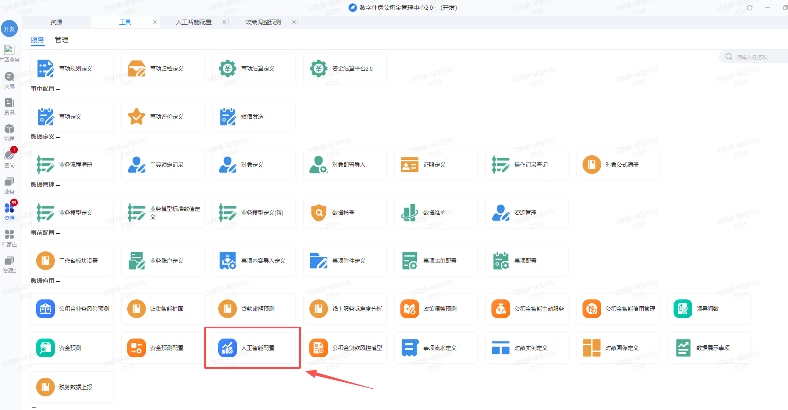
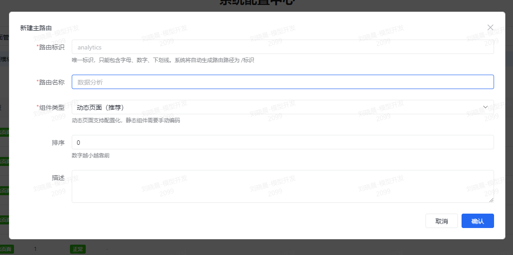
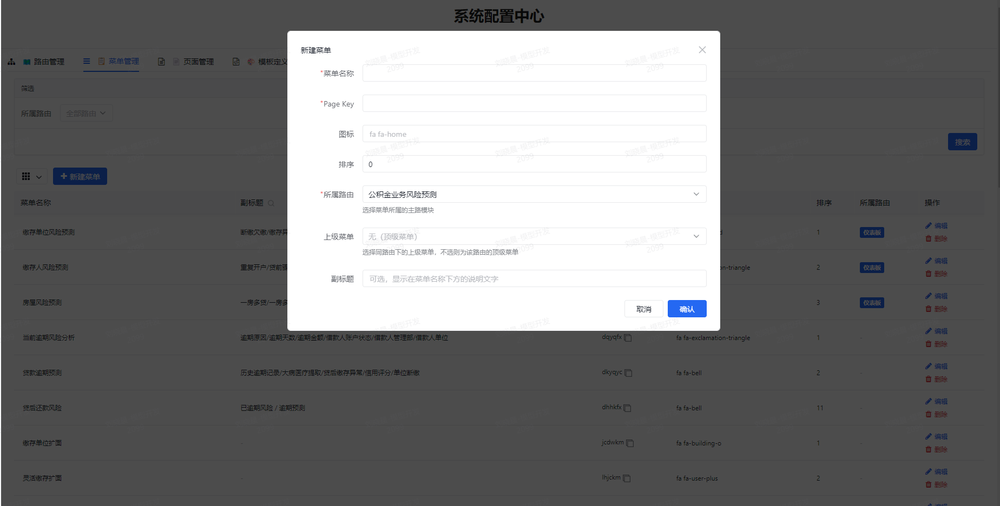
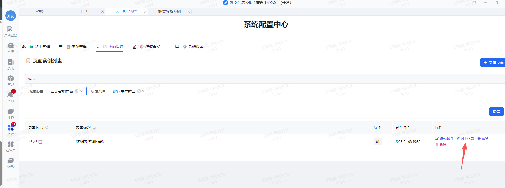
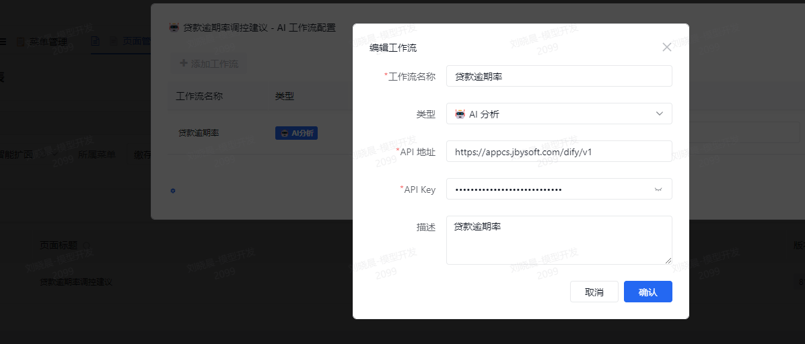
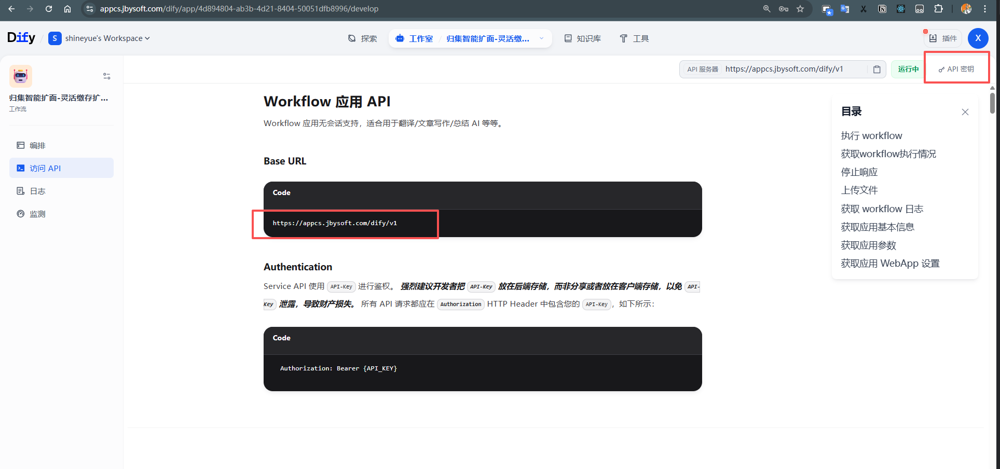
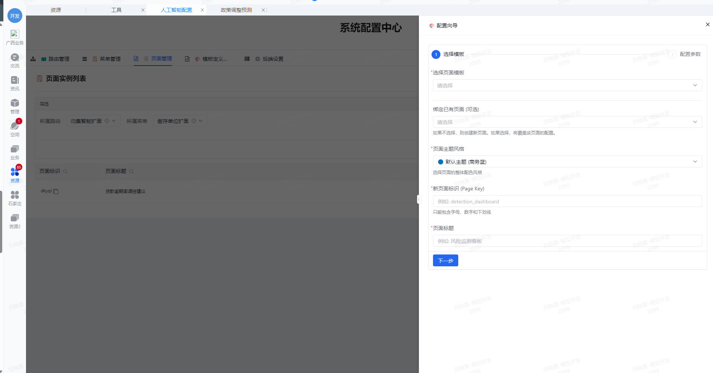
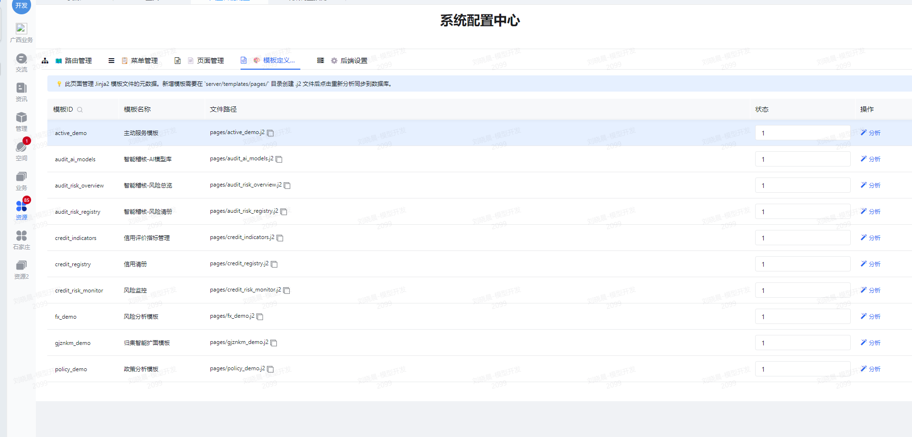
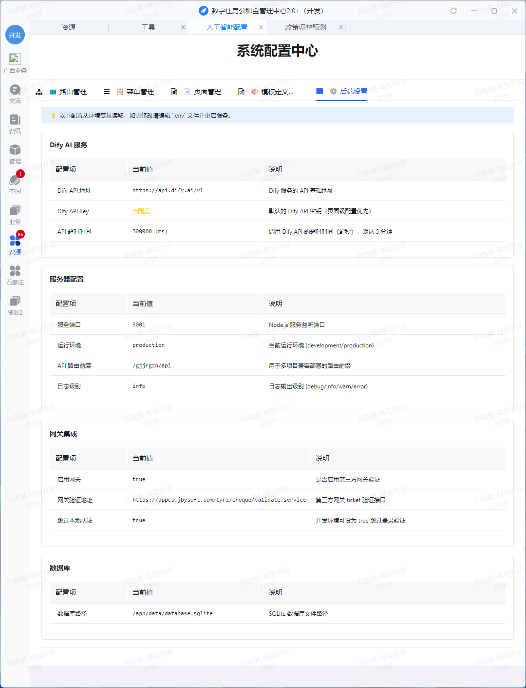

## 1. 准备工作

在开始配置之前，请确保您已经完成了系统的基础环境部署：

*   **部署状态**: 请参考《1.运维部署手册.md》完成 Docker 容器的启动，并确保服务状态为 `Up (healthy)`。
*   **访问验证**: 确保能够通过浏览器访问系统的健康检查接口（如 `http://localhost:3001/health`），返回状态正常。

---

## 2. 第一步：集成到贝贝系统

本项目（公积金 AI 大模型应用）通常作为子系统集成在“贝贝”统一管理平台中。请按照以下步骤添加菜单入口，使用户能够访问本系统。

使用以下 SQL 语句，将“人工智能配置”入口添加到 **工具-数据中台** 菜单中：

```sql
-- SQL 参数替换说明：
-- 1. 将 v_jgbh 替换为本中心的机构编号
-- 2. 将 BD_URL 中的 https://appcs.jbysoft.com 替换为本地映射的访问连接
-- 3. 将 ZXJSID 中的角色替换为要看到此工具的角色ID（从 pt_dxsl_jgbh_04 表中查询对应的角色ID）
-- 4. TB_URL 图标地址默认为空
INSERT INTO PT_JG_SX_CSH (ID, JGBH, SXFL, SXBS, SXMC, BD_URL, TB_URL, ZXJSID, ZDLX, CPBS, BKMC) 
VALUES (f_newid(), v_jgbh, '数据中台', '-10289', '人工智能配置', 'https://appcs.jbysoft.com/gjjrgzn/system/config', ' ', '10075208,10076373,1001068652271', '0', 'bbPro', '数据应用');
commit;
```



完成后，用户即可通过贝贝平台的导航栏点击对应事项进入本系统。

---

## 3. 功能配置指南

进入系统后，点击右上角的 **“系统配置”** 图标进入配置中心。配置中心是系统的“大脑”，用于定义系统的结构、页面和逻辑。

### 3.1 路由管理 (Route)
**用途**：当您需要开启一个新的**独立业务板块**时使用。路由是系统的顶层容器，通常不需要频繁变动。

*   **场景示例**：比如系统原本只有“数据分析”，现在要新增“信用管理”模块。
*   **配置步骤**：
    1.  点击 **“新建路由”**。
    2.  **路由标识** (必填)：如 `credit_mgr`。这将作为 URL 的第一级路径，必须全局唯一且不包含特殊字符。
    3.  **路由名称** (必填)：如 `信用管理`。用于在左侧菜单中显示该模块。
    4.  **组件类型** (必填)：默认为 `动态页面`。
        *   *动态页面*：支持通过配置和 AI 自动生成页面（推荐）。
        *   *静态页面*：需要开发者手动编写复杂的 JSON 代码（仅限高级用户）。
    5.  **排序** (选填)：数字越小越靠前。目前贝贝系统只使用单路由模式，此时无效果。
    6.  **描述** (选填)：仅作为内部备注，方便维护。

> **提示**：下方清册展示了当前系统所有已配置的路由，支持直接编辑属性。**删除前请务必确认**：该路由下未挂载任何菜单，否则可能导致导航栏显示异常。



### 3.2 菜单管理 (Menu)
**用途**：定义用户在左侧看到的**导航树**。

*   **场景示例**：在“信用管理”板块下，添加“企业信用评分”菜单。
*   **配置步骤**：
    1.  选择 **所属路由**（如 `信用管理`），菜单必须挂载在特定路由下。
    2.  点击 **“新建菜单”**。
    3.  **菜单名称** (必填)：侧边栏显示的标题。
    4.  **Page Key** (必填)：页面的唯一标识（如 `ent_score`）。它是系统关联页面配置的关键索引，建议使用英文命名。
    5.  **图标** (选填)：支持 Font Awesome v4.7 图标库。
        *   填写示例：`fa fa-home` 或 `fa fa-line-chart`。
        *   [图标参考列表](https://fontawesome.com/v4/icons/)
    6.  **排序** (选填)：数字越小越靠前。用于控制同级菜单的排列顺序。
    7.  **上级菜单** (选填)：若需创建二级菜单，请在此选择父节点。
        *   *注意*：一旦被选为父节点，该菜单将自动转为“分组目录”，点击时展开子菜单而非跳转页面。
    8.  **副标题** (选填)：显示在菜单名称下方的小字说明。

> **提示**：下方清册展示了当前系统所有已配置的菜单，支持直接编辑属性。**删除前请务必确认**：该菜单未关联任何页面且无子菜单，否则可能导致系统数据异常。


### 3.3 页面管理 (Page)
**用途**：创建和维护具体的**功能页面**。

*   **场景示例**：配置“企业信用评分”页面的具体内容，如查询表格、图表等。
*   **配置步骤**：
    1.  点击 **“新建页面”**，打开配置向导。
    2.  **选择模板**：在向导第一步，选择适合业务场景的页面模板（如“数据分析看板”或“列表查询页”）。
    3.  **绑定页面标识 (Page Key)**：
        *   **关键规则**：此处的 Page Key 必须与 **“菜单管理”** 中配置的 Page Key **完全一致**。
        *   *自动关联*：如果选择了“绑定已有页面”，系统会自动填充对应的 Page Key。
        *   *新建关联*：如果是全新页面，请确保手工输入的 Key 与菜单定义无误。
    4.  **填写参数**：根据所选模板，填写必要的业务参数（如 API 接口地址、图表标题等）。
    5.  **完成创建**：点击“提交”生成页面。
    6.  **页面预览**：在页面列表中，点击“预览”图标，即可在弹窗中查看配置后的页面效果。
*   **后续维护**：
    *   在页面列表中找到对应页面，点击 **“编辑配置”** 可重新打开向导修改参数。
    *   点击 **“AI工作流”** 可为页面绑定智能分析能力（详见下文）。
*   **AI 能力配置**：
    在页面列表中点击 **“AI工作流”**，如下图所示：

    

    点击 **“添加 AI 工作流”**，参照弹窗填写配置：

    

    1.  **工作流名称**：填写业务名称（如 `贷款风险分析`）。
    2.  **工作流类型**：根据需求选择以下类型：
        *   **AI 分析**：智能解读表格数据，提供洞察建议。
        *   **报告生成**：读取页面数据，生成 Word/PDF 分析报告。
        *   **数据导入**：解析上传的文件（如 PDF、图片）转化为结构化数据。
    3.  **API 地址**：填入 Dify 应用的 API URL（如 `https://api.dify.cn/v1`）。
    4.  **API Key**：填入对应应用的访问密钥。
        *   *参考下图获取 Dify 平台信息*：
        
    5.  **描述**：(选填) 补充说明工作流用途。
    > **注意**：不同类型的工作流通常对应 Dify 平台上不同的应用，请务必分别填写正确的地址和密钥。



### 3.4 模板定义 (Template Definition)
**用途**：管理 Jinja2 模板文件的元数据（仅供专业人员查阅）。

*   **说明**：
    *   此页面展示系统中已注册的 Jinja2 模板文件及其状态。
    *   **无需操作**：模板的维护由开发人员在后端文件系统中完成（`server/templates/pages/` 目录下的 `.j2` 文件），此前台页面仅做只读展示。

### 3.5 后端管理 (Backend)
**用途**：查看系统运行时的**环境变量**配置。

*   **说明**：
    *   此页面仅用于**展示**当前系统从环境变量中获取的配置值。
    *   **界面只读**：页面上的所有配置项均为只读状态，不支持直接修改。
*   **如何修改**：
    *   如需调整配置，请登录服务器修改 `docker-compose.yml` 文件中的环境变量配置，并重启服务生效。
**配置详情**：

详细的环境变量定义与修改方法，请参阅 **[运维部署手册](./1.运维部署手册.md)** 中的 “2.6 docker-compose.yml 配置说明” 章节。



---

## 4. 常见问题

**Q: 我在“菜单管理”里加了菜单，为什么左侧导航栏没显示？**
A: 请检查该菜单的“状态”开关是否已开启。另外，请确认您当前所在的“路由”模块与该菜单的“所属路由”一致（不同路由下的菜单是隔离显示的）。

**Q: 页面修改后，前台没变化？**
A: 这是为了性能考虑，前台会有短暂缓存。请尝试强制刷新浏览器 (Ctrl+F5 或 Shift+Cmd+R)。

**Q: 如何配置 AI 功能？**
A: 进入“页面管理”，找到对应页面，点击操作栏的“AI工作流”按钮。您需要填入 Dify 平台的 API Key 和 URL。如果您没有 Dify 账号，请联系技术支持。

**Q: 删除了通过“路由管理”创建的路由，该路由下的菜单还在吗？**
A: 菜单数据仍然存在，但因为失去了父级路由，它们可能无法在导航栏正常显示。建议在删除路由前，先清理或迁移其下的菜单。

**Q: 如何修改后端配置参数？**
A: 后端配置（如端口、密钥）由服务器环境变量控制。请登录服务器修改 `.env` 文件或 `docker-compose.yml`，然后重启容器。


