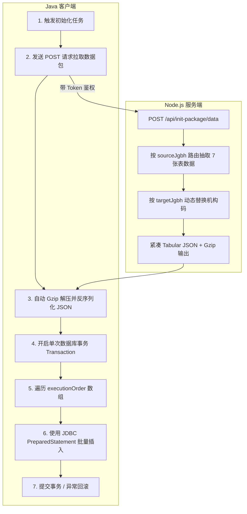

# 大模型系统基础数据初始化 - Java 端对接开发指南

本文档旨在为 Java 端研发人员提供对接「大模型业务标准库、关键算法与程序规则控制」数据初始化的完整规范与参考实现。

---

## 一、 核心流程与架构设计



### 核心优势与规范：
1. **天然跨数据库方言**：Java 端统一使用 JDBC `PreparedStatement` 批量入库，**完全无视 Oracle 4000 字节 CLOB 限制、特殊换行符或 SQL 转义问题**。
2. **极速网络传输**：采用 **Tabular 紧凑二维数组**（`columns` + `rows`），配合 HTTP **Gzip 压缩**，传输体积减少 85% 以上。
3. **顺序与事务安全**：返回结构中自带拓扑排序的 `executionOrder`，Java 端必须在**单次数据库事务**内按顺序批量执行。

---

## 二、 接口协议规范

### 1. 颁发长期 Token 接口（部署时调用一次即可）

* **请求方式**：`POST`
* **URL**：`http(s)://<HOST>/api/init-package/issue-token`
* **请求头**：`Content-Type: application/json`
* **请求体**：
  ```json
  {
    "username": "java_init_service",
    "role": "admin",
    "expiresIn": "3650d"
  }
  ```
* **响应示例**：
  ```json
  {
    "status": 0,
    "msg": "Token 颁发成功",
    "data": {
      "token": "eyJhbGciOiJIUzI1NiIsInR5cCI6IkpXVCJ9...",
      "expiresIn": "3650d"
    }
  }
  ```

---

### 2. 获取初始化数据包接口（Java 运行时调用）

* **请求方式**：`POST`
* **URL**：`http(s)://<HOST>/api/init-package/data`
* **请求头**：
  * `Authorization`: `Bearer <获取到的Token>`
  * `Content-Type`: `application/json`
  * `Accept-Encoding`: `gzip`（**必带**，启用服务端 Gzip 压缩）
* **请求体 (JSON)**：
  ```json
  {
    "sourceJgbh": "1305282025",   // 必输：源数据机构编码（用于数据源路由与算法规则查询）
    "sourceZjgbh": "1305282025",  // 必输：源数据子机构编码
    "targetJgbh": "320100",       // 可选：初始化到目标库的机构编码（若传入则自动替换 ywbz 和 cxgzkz 中的 jgbh）
    "targetZjgbh": "32010001",    // 可选：初始化到目标库的子机构编码
    "modules": ["ywbzk", "ywbz", "cxgzkz"] // 可选：指定初始化模块，默认全部
  }
  ```
* **响应体 (JSON)**：
  ```json
  {
    "status": 0,
    "msg": "获取初始化数据成功",
    "data": {
      "version": "1.0.0",
      "timestamp": "2026-08-20T16:00:00.000Z",
      "meta": {
        "sourceJgbh": "1305282025",
        "sourceZjgbh": "1305282025",
        "targetJgbh": "320100",
        "targetZjgbh": "32010001",
        "modules": ["ywbzk", "ywbz", "cxgzkz"],
        "totalRecords": 1655
      },
      "executionOrder": [
        "gjj_ywnrfl",
        "gjj_ywbzk",
        "gjj_ywbzksx",
        "gjj_ywbzkhc",
        "gjj_ywbz",
        "gjj_ywbzsx",
        "gjj_cxgzkz"
      ],
      "tables": {
        "gjj_ywnrfl": {
          "columns": ["id", "gjsjsf", "flbm", "flmc", "quanzhong", "pxh", "sfqy"],
          "rows": [
            [1, "21", "A01", "公积金归集", 1.0, 1, "y"],
            [2, "21", "A02", "公积金提取", 1.0, 2, "y"]
          ]
        },
        "gjj_ywbzk": {
          "columns": ["id", "gjsjsf", "flbh", "bzbh", "bzmc", ...],
          "rows": [...]
        },
        "gjj_ywbzksx": { ... },
        "gjj_ywbzkhc": { ... },
        "gjj_ywbz": { ... },
        "gjj_ywbzsx": { ... },
        "gjj_cxgzkz": { ... }
      }
    }
  }
  ```

---

## 三、 Java 端实现要求与核心规范

1. **严格按 `executionOrder` 顺序入库**：
   * 必须先插入主表（如 `gjj_ywnrfl`、`gjj_ywbzk`、`gjj_ywbz`），再插入从表（`gjj_ywbzksx`、`gjj_ywbzkhc`、`gjj_ywbzsx`、`gjj_cxgzkz`），以保证外键与主从依赖完整。
2. **事务原子性保证**：
   * 所有表的批量插入必须在一个完整的数据库事务内执行。
   * 任何一张表抛出异常，整个事务必须完整回滚（Rollback）。
3. **批量参数化写入（Batch PreparedStatement）**：
   * 禁止拼接原生 SQL 字符串，必须使用参数化绑定 `ps.setObject(colIndex, val)`。
   * 每 500~1000 行执行一次 `ps.executeBatch()`，提升写入性能。

---

## 四、 Java 端完整参考实现代码 (Spring Boot / JDBC)

### 1. Maven 依赖

```xml
<dependencies>
    <!-- HTTP 客户端（自动支持 Gzip 压缩与连接池） -->
    <dependency>
        <groupId>com.squareup.okhttp3</groupId>
        <artifactId>okhttp</artifactId>
        <version>4.12.0</version>
    </dependency>

    <!-- JSON 序列化库 -->
    <dependency>
        <groupId>com.alibaba.fastjson2</groupId>
        <artifactId>fastjson2</artifactId>
        <version>2.0.43</version>
    </dependency>

    <!-- Spring JDBC / 事务管理 -->
    <dependency>
        <groupId>org.springframework.boot</groupId>
        <artifactId>spring-boot-starter-jdbc</artifactId>
    </dependency>
</dependencies>
```

---

### 2. DTO 数据结构定义

```java
package com.example.init.dto;

import java.util.List;
import java.util.Map;

public class InitPackageResponse {
    private int status;
    private String msg;
    private InitPackageData data;

    // Getter & Setter
    public int getStatus() { return status; }
    public void setStatus(int status) { this.status = status; }
    public String getMsg() { return msg; }
    public void setMsg(String msg) { this.msg = msg; }
    public InitPackageData getData() { return data; }
    public void setData(InitPackageData data) { this.data = data; }

    public static class InitPackageData {
        private String version;
        private List<String> executionOrder;
        private Map<String, TableData> tables;

        public List<String> getExecutionOrder() { return executionOrder; }
        public void setExecutionOrder(List<String> executionOrder) { this.executionOrder = executionOrder; }
        public Map<String, TableData> getTables() { return tables; }
        public void setTables(Map<String, TableData> tables) { this.tables = tables; }
    }

    public static class TableData {
        private List<String> columns;
        private List<List<Object>> rows;

        public List<String> getColumns() { return columns; }
        public void setColumns(List<String> columns) { this.columns = columns; }
        public List<List<Object>> getRows() { return rows; }
        public void setRows(List<List<Object>> rows) { this.rows = rows; }
    }
}
```

---

### 3. 数据初始化落地核心服务 (`DatabaseInitService.java`)

```java
package com.example.init.service;

import com.alibaba.fastjson2.JSON;
import com.example.init.dto.InitPackageResponse;
import com.example.init.dto.InitPackageResponse.TableData;
import okhttp3.*;
import org.slf4j.Logger;
import org.slf4j.LoggerFactory;
import org.springframework.beans.factory.annotation.Autowired;
import org.springframework.stereotype.Service;
import org.springframework.transaction.annotation.Transactional;

import javax.sql.DataSource;
import java.io.IOException;
import java.sql.Connection;
import java.sql.PreparedStatement;
import java.sql.SQLException;
import java.util.HashMap;
import java.util.List;
import java.util.Map;
import java.util.concurrent.TimeUnit;
import java.util.stream.Collectors;

@Service
public class DatabaseInitService {

    private static final Logger log = LoggerFactory.getLogger(DatabaseInitService.class);

    @Autowired
    private DataSource targetDataSource;

    private final OkHttpClient httpClient = new OkHttpClient.Builder()
            .connectTimeout(15, TimeUnit.SECONDS)
            .readTimeout(60, TimeUnit.SECONDS)
            .build();

    /**
     * 1. 远程拉取初始化数据包 (自动支持 Gzip 传输)
     */
    public InitPackageResponse fetchInitPackage(String baseUrl, String token, String sourceJgbh, String sourceZjgbh, String targetJgbh, String targetZjgbh) throws IOException {
        String url = baseUrl.replaceAll("/+$", "") + "/api/init-package/data";

        Map<String, Object> bodyMap = new HashMap<>();
        bodyMap.put("sourceJgbh", sourceJgbh);
        bodyMap.put("sourceZjgbh", sourceZjgbh);
        if (targetJgbh != null && !targetJgbh.isEmpty()) {
            bodyMap.put("targetJgbh", targetJgbh);
        }
        if (targetZjgbh != null && !targetZjgbh.isEmpty()) {
            bodyMap.put("targetZjgbh", targetZjgbh);
        }

        String jsonBody = JSON.toJSONString(bodyMap);

        Request request = new Request.Builder()
                .url(url)
                .addHeader("Authorization", "Bearer " + token)
                .addHeader("Content-Type", "application/json")
                .addHeader("Accept-Encoding", "gzip")
                .post(RequestBody.create(jsonBody, MediaType.parse("application/json; charset=utf-8")))
                .build();

        try (Response response = httpClient.newCall(request).execute()) {
            if (!response.isSuccessful()) {
                throw new IOException("拉取数据包失败，HTTP Code: " + response.code() + ", msg: " + response.body().string());
            }
            String respText = response.body().string();
            InitPackageResponse res = JSON.parseObject(respText, InitPackageResponse.class);
            if (res == null || res.getStatus() != 0 || res.getData() == null) {
                throw new RuntimeException("服务端返回错误: " + (res != null ? res.getMsg() : "响应为空"));
            }
            return res;
        }
    }

    /**
     * 2. 执行目标数据库数据初始化 (事务控制 + 拓扑顺序 JDBC Batch 写入)
     */
    @Transactional(rollbackFor = Exception.class)
    public void executeInitToDatabase(InitPackageResponse.InitPackageData packageData) throws SQLException {
        List<String> executionOrder = packageData.getExecutionOrder();
        Map<String, TableData> tables = packageData.getTables();

        try (Connection conn = targetDataSource.getConnection()) {
            // 确保由 Spring 事务管理自动提交状态
            log.info("开始向目标数据库批量导入初始化数据，待处理表数量: {}", executionOrder.size());

            for (String tableName : executionOrder) {
                TableData tableData = tables.get(tableName);
                if (tableData == null || tableData.getRows() == null || tableData.getRows().isEmpty()) {
                    log.info("表 [{}] 无数据，跳过", tableName);
                    continue;
                }

                insertTableBatch(conn, tableName, tableData);
            }

            log.info("恭喜！所有初始化表数据已成功批量写入目标数据库！");
        }
    }

    /**
     * 3. 动态组装参数化 PreparedStatement 并批量执行
     */
    private void insertTableBatch(Connection conn, String tableName, TableData tableData) throws SQLException {
        List<String> columns = tableData.getColumns();
        List<List<Object>> rows = tableData.getRows();

        // 构造 INSERT INTO <table> (col1, col2) VALUES (?, ?)
        String colListStr = String.join(", ", columns);
        String placeHolders = columns.stream().map(c -> "?").collect(Collectors.joining(", "));
        String insertSql = String.format("INSERT INTO %s (%s) VALUES (%s)", tableName, colListStr, placeHolders);

        log.info("正在导入表 [{}]，记录数: {}, SQL: {}", tableName, rows.size(), insertSql);

        try (PreparedStatement ps = conn.prepareStatement(insertSql)) {
            int batchCount = 0;
            for (List<Object> row : rows) {
                for (int i = 0; i < columns.size(); i++) {
                    Object val = (i < row.size()) ? row.get(i) : null;
                    ps.setObject(i + 1, val);
                }
                ps.addBatch();
                batchCount++;

                // 每 500 条刷盘一次批处理
                if (batchCount % 500 == 0) {
                    ps.executeBatch();
                }
            }
            if (batchCount % 500 != 0) {
                ps.executeBatch();
            }
        }
        log.info("表 [{}] 导入完成，成功写入 {} 条记录", tableName, rows.size());
    }
}
```

---

### 5. 快速调用示例（Runner / Controller）

```java
@Component
public class InitRunner implements CommandLineRunner {

    @Autowired
    private DatabaseInitService initService;

    @Override
    public void run(String... args) {
        String baseUrl = "https://appcs.jbysoft.com/gjj_gjsjjsmx";
        String token = "eyJhbGciOiJIUzI1NiIsInR5cCI6IkpXVCJ9...";
        String sourceJgbh = "1305282025";
        String sourceZjgbh = "1305282025";
        String targetJgbh = "320100";
        String targetZjgbh = "32010001";

        try {
            // 1. 获取数据包
            InitPackageResponse response = initService.fetchInitPackage(
                    baseUrl, token, sourceJgbh, sourceZjgbh, targetJgbh, targetZjgbh
            );

            // 2. 写入数据库
            initService.executeInitToDatabase(response.getData());
            
            System.out.println("数据初始化全流程执行成功！");
        } catch (Exception e) {
            e.printStackTrace();
        }
    }
}
```
