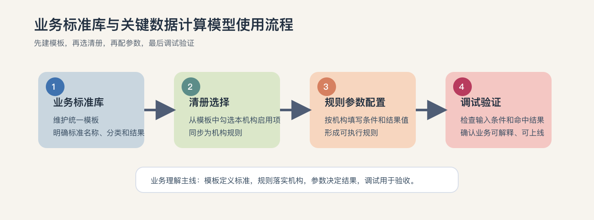
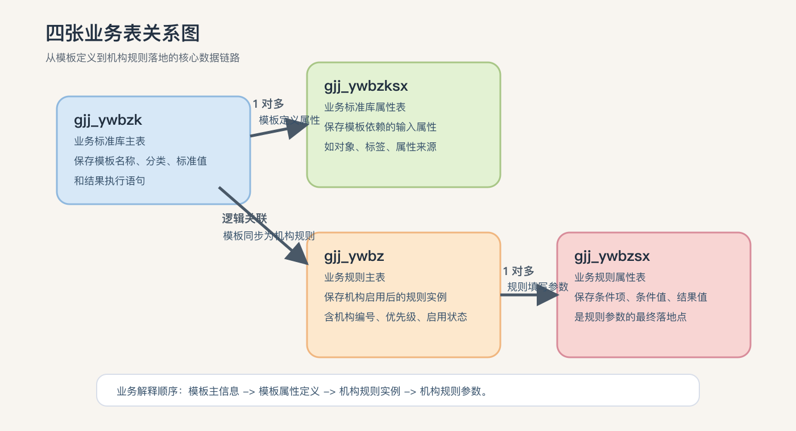
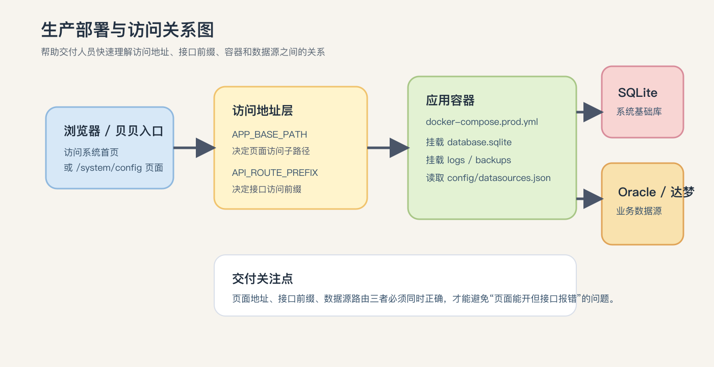

```{=openxml}
<w:p>
  <w:pPr>
    <w:jc w:val="center"/>
    <w:spacing w:before="2200" w:after="160"/>
  </w:pPr>
  <w:r>
    <w:rPr>
      <w:rFonts w:eastAsia="黑体"/>
      <w:b/>
      <w:color w:val="1F4ACC"/>
      <w:sz w:val="32"/>
    </w:rPr>
    <w:t>业务标准库与关键数据计算模型</w:t>
  </w:r>
</w:p>
<w:p>
  <w:pPr>
    <w:jc w:val="center"/>
    <w:spacing w:after="160"/>
  </w:pPr>
  <w:r>
    <w:rPr>
      <w:rFonts w:eastAsia="黑体"/>
      <w:b/>
      <w:color w:val="1F4ACC"/>
      <w:sz w:val="28"/>
    </w:rPr>
    <w:t>部署及使用手册</w:t>
  </w:r>
</w:p>
<w:p>
  <w:pPr>
    <w:jc w:val="center"/>
    <w:spacing w:before="260" w:after="1800"/>
  </w:pPr>
  <w:r>
    <w:rPr>
      <w:rFonts w:eastAsia="黑体"/>
      <w:b/>
      <w:sz w:val="34"/>
    </w:rPr>
    <w:t>用户手册</w:t>
  </w:r>
</w:p>
```

| 项目 | 内容 | 项目 | 内容 |
| --- | --- | --- | --- |
| 文件编号 | `{项目编号}` / `HW-SP-CV-T07` | 文件状态 | `[ ] 草稿  [x] 正式发布  [ ] 正在修改` |
| 当前版本 | `V1.0` | 发布日期 | `2026-03-13` |
| 拟制 | `项目组` | 日期 | `2026-03-13` |
| 审核 | `待补充` | 日期 | `待补充` |
| 批准 | `待补充` | 日期 | `待补充` |

```{=openxml}
<w:p><w:r><w:br w:type="page"/></w:r></w:p>
```

```{=openxml}
<w:p>
  <w:pPr>
    <w:jc w:val="center"/>
    <w:spacing w:before="240" w:after="240"/>
  </w:pPr>
  <w:r>
    <w:rPr>
      <w:rFonts w:eastAsia="黑体"/>
      <w:b/>
      <w:sz w:val="28"/>
    </w:rPr>
    <w:t>修订历史记录</w:t>
  </w:r>
</w:p>
```

| 变更版本号 | 日期 | 变更类型(A/M/D) | 修改人 | 摘要 | 备注 |
| --- | --- | --- | --- | --- | --- |
| `V1.0` | `2026-03-13` | `A` | `项目组` | 首次整理部署及使用手册，补充封面、修订历史、目录及正文结构优化 | 初版 |
|  |  |  |  |  |  |
|  |  |  |  |  |  |
|  |  |  |  |  |  |
|  |  |  |  |  |  |

> 说明：
> `A` 表示增加，`M` 表示修改，`D` 表示删除。后续每次版本调整时，仅需补充本页修订记录。

```{=openxml}
<w:p><w:r><w:br w:type="page"/></w:r></w:p>
<w:p>
  <w:pPr>
    <w:jc w:val="center"/>
    <w:spacing w:before="240" w:after="180"/>
  </w:pPr>
  <w:r>
    <w:rPr>
      <w:rFonts w:eastAsia="黑体"/>
      <w:b/>
      <w:sz w:val="28"/>
    </w:rPr>
    <w:t>目录</w:t>
  </w:r>
</w:p>
<w:p>
  <w:r><w:fldChar w:fldCharType="begin"/></w:r>
  <w:r><w:instrText xml:space="preserve"> TOC \o "1-3" \h \z \u </w:instrText></w:r>
  <w:r><w:fldChar w:fldCharType="separate"/></w:r>
  <w:r><w:t>目录将在打开文档后自动更新。若未显示，请在 Word 中右键目录并选择“更新域”。</w:t></w:r>
  <w:r><w:fldChar w:fldCharType="end"/></w:r>
</w:p>
<w:p><w:r><w:br w:type="page"/></w:r></w:p>
```

## 一、手册说明

本手册面向业务人员、实施人员、运维人员和系统管理员，用于说明系统页面使用、数据关系、初始化部署和贝贝入口接入方法。

手册内容覆盖页面用途与操作流程、相关接口用途、初始化脚本与初始化方式、四张业务表的结构说明与关系说明、生产部署方式以及贝贝入口添加方式。

源码实现细节不在本手册说明范围内；系统使用、初始化、部署、迁移和排查所需的信息均已纳入正文。

适用范围包括首次部署或升级本系统、初始化业务标准库与关键数据计算模型数据、将本系统接入贝贝统一入口，以及对标准模板、机构规则和参数配置进行日常维护。

建议阅读路径如下：只关注日常使用时重点阅读第三、四部分；负责部署实施时重点阅读第五、六、七部分；负责交付验收时建议完整阅读全文。

> 说明：
> 手册中的接口路径均为逻辑路径。生产环境实际访问地址通常为 `服务域名 + API_ROUTE_PREFIX + 逻辑接口路径`。

## 二、整体架构总览

先说明整体架构，再进入各分项内容。

### 1. 系统定位

这套能力可以分成两层：`业务标准库` 负责维护统一的标准模板，`关键数据计算模型` 负责在某个机构下启用模板，并配置本机构实际生效的参数。

### 2. 业务主线

业务上可以这样理解：

1. 先在标准库中定义“有哪些标准”
2. 再在关键数据计算模型中决定“本机构启用哪些标准”
3. 最后给这些标准填写“本机构的参数和取值规则”

{ width=78% }

### 3. 数据主线

数据落地时，核心链路依次是标准模板主信息、模板依赖属性、机构启用后的规则主信息以及规则参数明细，这四部分会在第四章展开说明。

### 4. 部署主线

系统落地通常按以下顺序推进：

1. 先准备部署环境和配置文件
2. 再使用公司提供的 SQLite 数据库并导入业务标准库数据
3. 再完成页面访问验证和业务验收
4. 如有统一门户要求，再补充贝贝入口

### 5. 阅读导航

手册按照以下“总分结构”展开：第三章分项说明两个核心页面的用途与操作方法；第四章说明四张核心业务表的关系和业务含义；第五章说明初始化方式和首批数据准备；第六章说明生产部署、访问验证和回滚方法；第七章说明贝贝入口接入方法；第八章到第十章给出使用顺序、常见建议和总结。

### 6. 高频术语说明

高频术语如下：`模板` 指业务标准库中的标准模板，`规则` 指关键数据计算模型中已同步到机构下的规则实例，`模型机构` 指 `mechanismMmodel=1` 的机构，`运营机构` 指 `mechanismMmodel=2` 的机构，`现场环境` 指 `mechanismMmodel=3` 的环境，`APP_BASE_PATH` 指系统前端访问子路径，例如 `/gjj_gjsjjsmx/`，`API_ROUTE_PREFIX` 指系统接口访问前缀，例如 `/gjj_gjsjjsmx/api`。

模型环境判断方式如下：

- 登录贝贝系统后，查看请求 `tyrz/cheque/bind.service` 的入参。
- 入参中的 `mechanismMmodel` 值用于判断当前环境类型。
- `mechanismMmodel=1` 表示模型机构。
- `mechanismMmodel=2` 表示运营机构。
- `mechanismMmodel=3` 表示现场环境。

> 核心理解：
> 业务标准库解决“标准从哪里来”，关键数据计算模型解决“本机构最终怎么用”。

## 三、页面使用说明

页面说明按“先业务标准库、再关键数据计算模型”的顺序展开。

### 1. 业务标准库

#### 1.1 页面作用

业务标准库用于维护全局模板，主要解决一项业务标准叫什么、属于哪种算法、适用于哪类业务内容、依赖哪些输入条件，以及标准值、说明或计算依据是什么等问题。

这里维护的是模板，不是某个机构最终执行的规则。

#### 1.2 页面查询

页面支持按关键数据算法、业务内容分类和业务办理标准进行筛选，适合用来查看某一算法下有哪些模板、某一业务场景下模板是否齐全，以及某条模板是否已经存在。

#### 1.3 新增或编辑模板

新增或编辑模板时，建议按下面四类信息依次整理：

- 基础识别信息：`排序号`、`业务办理标准`、`业务办理标准描述`
- 分类归属信息：`关键数据算法`、`业务内容分类`、`业务办理标准分类`
- 结果定义信息：`业务标准值`、`业务办理标准结果执行语句`
- 条件依赖信息：`业务办理标准属性组`

填写建议如下：模板名称尽量直接表达业务含义，模板描述重点说明适用场景和边界条件，结果执行语句要能对应实际政策或判断逻辑，属性组要覆盖后续规则配置必需的条件项。

#### 1.4 模板属性组怎么理解

模板属性组表示：这条标准在判断时需要哪些输入要素。

常见示例包括缴存人类型、婚姻状态、子女数量、贷款用途和房屋类型。每个属性通常还需要补齐所属对象、服务对象标签、属性名称、属性来源和来源语句等信息。

> 注意：
> 如果模板属性定义不完整，后续在“关键数据计算模型”中就无法完整配置规则参数。

#### 1.5 删除模板

删除模板要谨慎，因为模板删除后，可能会影响已经同步到机构下的规则。

建议仅在明确属于重复模板、明确属于错误模板，或已经完成新旧模板切换时删除。

更稳妥的做法通常是沿用旧模板、补充新模板，再逐步替换机构规则。

#### 1.6 导出与导入

业务标准库支持全量导出和全量导入。

适用场景主要包括新环境初始化、从模型机构向其他环境发布模板以及备份或恢复模板数据。导入前应确认来源可靠，导入后应抽查关键算法和业务分类是否完整；如涉及批量替换，建议先导出一份当前数据作为回退依据。

#### 1.7 页面涉及的主要接口

说明：

- 下表中的接口路径为逻辑路径
- 生产环境实际访问地址 = `服务域名` + `API_ROUTE_PREFIX` + 具体接口路径
- 例如当 `API_ROUTE_PREFIX=/gjj_gjsjjsmx/api` 时，`/api/ywbzk/list` 的实际访问地址应理解为 `/gjj_gjsjjsmx/api/ywbzk/list`

常用接口清单：

- `/api/ywbzk/list`：查询模板列表
- `/api/ywbzk/get`：查询单条模板详情
- `/api/ywbzk/save`：保存新增或编辑结果
- `/api/ywbzk/delete`：删除模板
- `/api/ywbzk/standards`：获取业务办理标准下拉选项
- `/api/ywbzk/export`：全量导出标准库
- `/api/ywbzk/import`：全量导入标准库
- `/api/ywbzk/mode`：获取当前机构是否允许维护标准库

#### 1.8 页面权限说明

业务标准库通常作为统一模板维护区使用。

建议按以下原则管理：模型机构负责新增、编辑、删除，运营机构和现场环境主要负责查看、导入、导出和接收模板。现场判断时，以贝贝登录后 `tyrz/cheque/bind.service` 入参中的 `mechanismMmodel` 值为准。

### 2. 关键数据计算模型

#### 2.1 页面作用

关键数据计算模型页面用于维护“本机构实际启用的规则”。

它主要完成三类工作：选择本机构要启用的模板、给模板配置本机构的参数值，以及对规则进行调试和验证。

#### 2.2 页面查询

页面支持按关键数据算法和业务内容分类筛选；查询结果通常会显示所属算法、业务内容分类、业务办理标准和业务办理标准描述，适合用来查看当前机构在某个算法下已经启用了哪些规则，以及某类业务场景下规则是否配置完整。

#### 2.3 清册选择

“清册选择”用于从标准库中勾选模板，并同步为本机构规则。

推荐操作顺序：

1. 选择关键数据算法
2. 必要时选择业务内容分类
3. 点击“清册选择”
4. 勾选本机构要启用的模板
5. 保存

业务上可以这样理解：标准库里的是“可选模板”，清册选择后才会变成“本机构规则”。

#### 2.4 规则参数配置

完成清册选择后，还需要进行“规则参数配置”。

规则参数配置用于给本机构规则补充具体参数值，例如某类人员对应什么条件、某种场景下结果值是什么，以及多个条件组合对应什么结果。

如果没有完成参数配置，规则通常是不完整的。

#### 2.5 删除规则

如果某条规则不再适用于本机构，可以在本页面删除。

常见场景包括同步了不需要的模板、政策变化后不再执行某类规则，或者需要重新按新版模板配置。

删除前建议确认是否存在替代规则，避免业务场景出现空缺。

#### 2.6 导出与导入

关键数据计算模型页面支持全量导出、全量导入、部分导出和部分导入，适合用于机构级规则备份、多环境迁移、调整前留存基线以及局部规则替换。

如果只是迁移某一部分规则，优先建议使用“部分导出 / 部分导入”。

#### 2.7 调试

调试用于验证规则在真实输入条件下的执行结果。

调试适合在新增规则后、修改参数后、大批量导入后以及上线前验收时使用。调试时重点关注输入条件是否正确、结果是否符合业务预期，以及明细过程是否能解释最终结果。

#### 2.8 页面涉及的主要接口

说明：

- 下表中的接口路径为逻辑路径
- 生产环境实际访问地址 = `服务域名` + `API_ROUTE_PREFIX` + 具体接口路径
- 例如当 `API_ROUTE_PREFIX=/gjj_gjsjjsmx/api` 时，`/api/ywbz/list` 的实际访问地址应理解为 `/gjj_gjsjjsmx/api/ywbz/list`

常用接口清单：

- `/api/ywbz/list`：查询当前机构规则列表
- `/api/ywbz/get`：查询规则详情
- `/api/ywbz/save`：保存规则主信息
- `/api/ywbz/delete`：删除规则
- `/api/ywbz/config_form`：加载规则参数配置表单
- `/api/ywbz/save_params`：保存规则参数
- `/api/ywbz/selection_list`：查询清册可选模板
- `/api/ywbz/batch`：保存清册选择结果
- `/api/ywbz/export`：全量导出规则
- `/api/ywbz/import`：全量导入规则
- `/api/ywbz/partial_export`：部分导出规则
- `/api/ywbz/partial_import`：部分导入规则
- `/api/ywbz/debug`：执行规则调试
- `/api/ywbz/debug_log`：查询调试日志明细

## 四、四张表的业务关系与表结构说明

系统底层围绕四张核心表管理这套数据。

### 1. 四张表分别是什么

- `gjj_ywbzk`：业务标准库主表，保存模板主信息
- `gjj_ywbzksx`：业务标准库属性表，保存模板依赖的输入属性
- `gjj_ywbz`：业务规则主表，保存机构级规则实例
- `gjj_ywbzsx`：业务规则属性表，保存机构级规则参数值

{ width=76% }

### 2. 四张表之间的关系

可以用下面这条链路理解：

`先定义标准模板 -> 再定义模板属性 -> 再同步成机构规则 -> 最后填写规则参数`

对应关系如下：

- `gjj_ywbzk.id = gjj_ywbzksx.mbid`
  模板主表与模板属性表是一对多关系，一个模板可以定义多条输入属性。
- `gjj_ywbzk.id = gjj_ywbz.mbid`
  模板主表与规则主表是逻辑关联关系，一个模板可以被多个机构同步成多条规则实例。
- `gjj_ywbz.id = gjj_ywbzsx.ywid`
  规则主表与规则属性表是一对多关系，一条规则可以配置多行参数。

### 3. 表结构概览

#### 3.1 业务标准库主表 `gjj_ywbzk`

主要字段：

- `id`：主键
- `pxh`：排序号
- `ywblbz`：业务办理标准
- `ywblbzsm`：业务办理标准说明
- `gjsjsf`：关键数据算法
- `ywnrfl`：业务内容分类
- `bzfl`：标准分类
- `ywbzz`：业务标准值
- `ywbzjg`：业务标准结果执行语句
- `cjsj`：创建时间
- `gxsj`：更新时间

这张表更适合业务上理解为“模板清单”。

#### 3.2 业务标准库属性表 `gjj_ywbzksx`

主要字段：

- `id`：主键
- `mbid`：所属模板 ID
- `ywblbzdx`：业务办理标准对象
- `fwdxbq`：服务对象标签
- `sxbm`：属性名称或属性编码
- `ywblbzsx`：业务办理标准属性
- `sxly`：属性来源
- `ywblbzyg`：属性来源执行语句
- `cjsj`：创建时间
- `gxsj`：更新时间

这张表更适合业务上理解为“模板需要哪些输入条件”。

#### 3.3 业务规则主表 `gjj_ywbz`

主要字段：

- `id`：主键
- `mbid`：来源模板 ID
- `ywsf`：业务算法
- `ywnrfl`：业务内容分类
- `gzmc`：规则名称
- `gzljsm`：规则逻辑说明
- `yxj`：优先级
- `sfqy`：是否启用
- `jgbh`：机构编号
- `zjgbh`：子机构编号
- `ywbzz`：业务标准值
- `cjsj`：创建时间
- `gxsj`：更新时间

这张表更适合业务上理解为“机构已经启用的规则主信息”。

#### 3.4 业务规则属性表 `gjj_ywbzsx`

主要字段：

- `id`：主键
- `ywid`：所属规则 ID
- `row_index`：行序号
- `k1 ~ k10`：条件项名称
- `v1 ~ v10`：条件项取值
- `result`：结果值
- `cjsj`：创建时间
- `gxsj`：更新时间

这张表更适合业务上理解为“规则参数明细和结果映射表”。

### 4. 对业务人员的理解方式

如果不看数据库，可以把四张表理解为：第一张表是模板主信息，第二张表是模板需要哪些条件，第三张表是机构启用了哪些模板，第四张表是机构给这些模板配置了什么参数。

> 交付建议：
> 现场讲解时，优先讲清“四张表链路图”，再讲字段含义，业务人员会更容易理解。

## 五、如何初始化数据

初始化数据时，重点分为两部分：系统库文件准备，以及业务标准与规则初始化。

### 1. 系统库文件准备

首次部署时，系统基础内容不再单独执行初始化命令，直接使用公司提供的 SQLite 数据库文件即可。

使用方式如下：

- 将公司提供的 `database.sqlite` 放入部署目录的 `data/` 下。
- 启动容器时直接挂载该 SQLite 文件。

适用场景包括首次部署、交付环境搭建和标准运行环境恢复。

### 2. 业务标准与规则初始化

业务标准与规则初始化主要对应这四张业务表。

初始化前需要先准备好数据源配置。

配置文件路径分为两类：参考公司提供的 `datasources.json`，生产部署实际路径为 `config/datasources.json`。

初始化可按以下两种方式进行。

#### 方式一：通过 SQL 直接初始化数据库

适用场景：

- 首次建表
- 由数据库管理员直接执行初始化
- 现场更习惯通过 SQL 文件进行落库

对应初始化 SQL：

- Oracle：附件中的`init_business_standards_oracle.sql`
- 达梦：附件中的`init_business_standards_dm.sql`

说明：

- 附件中的初始化 SQL 为整套业务初始化脚本，覆盖四张业务主表、相关辅助表以及配套存储过程。
- 现场执行时，应以整套附件 SQL 为准，不要只执行四张主表的建表语句。
- 如采用脚本方式初始化，本质上调用的仍是同一套初始化 SQL。

#### 方式二：通过脚本执行初始化

##### Oracle 环境初始化

常用命令：

```bash
cd server
npm run db:init:oracle
```

对应脚本为 `server/scripts/init_oracle_db.js`，对应初始化 SQL 为 `server/data/init_business_standards_oracle.sql`。

##### 达梦环境初始化

常用命令：

```bash
cd server
npm run db:init:dm
```

对应脚本为 `server/scripts/init_dm_db.js`，对应初始化 SQL 为 `server/data/init_business_standards_dm.sql`。

### 3. 初始化后的首批数据准备

业务上建议按下面顺序进行：

1. 先放置公司提供的 SQLite 数据库文件
2. 再初始化四张业务表，辅助表及存储过程
3. 优先导入业务标准库模板数据
4. 在关键数据计算模型页面做清册选择
5. 为规则填写参数值
6. 做调试验证
7. 导出一份备份文件留档

### 4. 首批数据导入的三种常用方式

#### 方式一：先导入业务标准库

首次部署建议优先采用这种方式。适合场景包括已有成熟模板库，或模型机构已经维护好模板。操作思路是先在业务标准库页面执行全量导入，再去关键数据计算模型页面进行清册选择。

#### 方式二：按算法逐步启用

适合场景包括新环境首次上线，或规则较多需要分阶段启用。操作思路是先选一个算法，再按业务内容分类逐步做清册选择，并在每批配置完成后立即调试。

#### 方式三：直接导入机构规则

适合场景包括某个机构已经有一套可用规则，或需要迁移到测试、预发或生产环境。操作思路是在关键数据计算模型页面使用全量导入或部分导入，并在导入后重点检查规则数量和参数完整性。

> 初始化完成后至少做三项检查：
> 模板数量是否符合预期，关键算法下规则是否完整，典型业务场景能否调试通过。

## 六、生产部署（docker-compose.yml）

本系统支持通过 `docker-compose.yml` 在生产环境部署。

生产部署章节适合现场实施人员、运维人员以及负责上线验收的系统管理员参考。

{ width=76% }

### 1. 部署前准备

建议在服务器上准备独立部署目录，例如：

```text
/opt/damoxing/
  docker-compose.yml
  data/
    database.sqlite
    logs/
    backups/
  config/
    datasources.json
```

目录说明如下：`data/database.sqlite` 为系统库文件，`data/logs/` 为日志目录，`data/backups/` 为备份目录，`config/datasources.json` 为业务库多数据源配置。部署前建议确认服务器已安装 Docker 和 Docker Compose，已拿到正确版本的镜像和 `docker-compose.yml`，已准备现场 `datasources.json`，并已确认现场访问域名、端口和子路径。

### 2. 服务器基础要求

建议满足以下条件：Linux 服务器、Docker 20.10 及以上、Docker Compose 2.x，内存建议 4GB 及以上，磁盘建议 20GB 及以上。

部署前可先确认 CPU 架构：

```bash
uname -m
```

### 3. `docker-compose.yml` 重点配置项

生产部署前建议重点核对以下配置：`image`、`ports`、`APP_BASE_PATH`、`API_ROUTE_PREFIX`、`CORS_ORIGIN`、`JWT_SECRET`、`JWT_EXPIRES_IN`、`GATEWAY_VALIDATE_URL`、`GATEWAY_ENABLED`、`SKIP_LOCAL_AUTH`、`DB_PATH` 和 `LOG_DIR`。其中前四项直接影响访问路径和接口调用。

> 注意：
> `APP_BASE_PATH` 和 `API_ROUTE_PREFIX` 必须保持同一套访问前缀，否则容易出现页面能打开、接口却 404 的情况。

### 4. 多数据源配置

生产环境中的业务库配置文件为：

- `config/datasources.json`

这个文件通常需要配置默认数据源、是否启用严格路由、Oracle 或达梦的数据源清单、每个数据源负责的 `jgbh` 范围以及数据库连接信息。

常见重点字段包括 `default_datasource`、`strict_routing`、`datasources[].id`、`datasources[].type`、`datasources[].jgbh_list`、`config.user`、`config.password`、`config.connectString` 以及 `config.poolMin/poolMax`。配置原则建议为：同一个 `jgbh` 只归属一个数据源，生产环境启用严格路由，数据库账号密码由运维统一保管，文件以只读方式挂载到容器中。

### 5. 标准部署步骤

建议按以下顺序执行：

#### 第一步：准备部署目录

```bash
cd /opt/damoxing
mkdir -p ./data/logs ./data/backups ./config
```

#### 第二步：放置部署文件

需要准备 `docker-compose.yml`、`config/datasources.json`；如为升级场景，还需要沿用原有 `data/` 目录。

#### 第三步：确认配置文件存在

```bash
test -f ./config/datasources.json && echo "datasources.json OK"
```

#### 第四步：启动服务

```bash
docker compose -f docker-compose.yml up -d
docker compose -f docker-compose.yml ps
```

#### 第五步：初始化系统和业务数据

先放置公司提供的 `database.sqlite`，再准备业务四张表所需的数据结构；生产环境执行时，请以部署目录中的配置文件和实际业务库为准，不要直接照搬 `cd server` 这类源码目录命令；首次部署建议优先导入业务标准库数据，再完成清册选择、参数配置和调试验证。

#### 第六步：完成访问与业务验收

建议检查健康检查接口、页面访问路径、至少一个真实机构的业务查询，以及标准库和规则页面是否可正常打开。

### 6. 部署后的访问与验证

默认端口映射一般为宿主机 `30200` 对应容器 `80`。

常见验证方式如下。

#### 健康检查

```bash
curl -fsS http://127.0.0.1:30200/health
```

#### 查看日志

```bash
docker compose -f docker-compose.yml logs -f --tail 200 app
```

#### 浏览器访问

浏览器基础访问地址一般为 `http://服务器IP:30200/`。如果配置了 `APP_BASE_PATH`，系统会跳转到对应子路径，例如 `http://服务器IP:30200/gjj_gjsjjsmx/`。访问判断要点是：页面根路径由 `APP_BASE_PATH` 决定，接口访问根路径由 `API_ROUTE_PREFIX` 决定，两者必须保持一致。

### 7. 上线验收建议

上线后至少建议检查容器状态是否正常、健康检查是否返回正常、页面能否正常打开、`datasources.json` 是否已正确挂载、日志目录是否正常写入、标准库和关键数据计算模型页面能否正常访问，以及至少一个真实机构编号能正常查询业务数据。

### 8. 备份、升级与回滚

#### 手工备份

升级前建议先做一次系统库备份：

```bash
docker compose -f docker-compose.yml exec app sh -lc "/app/backup-db.sh"
ls -la ./data/backups/
```

#### 升级

常见方式：

1. 更新 `docker-compose.yml` 中镜像版本
2. 拉取或导入新镜像
3. 重启服务

```bash
docker compose -f docker-compose.yml pull
docker compose -f docker-compose.yml up -d
```

#### 回滚

常见方式：

1. 切回旧镜像版本
2. 必要时恢复历史 SQLite 备份
3. 重启服务

```bash
docker compose -f docker-compose.yml down
cp ./data/backups/database_YYYYMMDD_HHMMSS.sqlite ./data/database.sqlite
docker compose -f docker-compose.yml up -d
```

## 七、添加贝贝入口

本系统通常可以作为子系统接入“贝贝”统一管理平台。

如果现场需要通过贝贝菜单直接进入本系统，可以在贝贝系统中增加菜单入口。

### 1. 使用场景

适合以下情况：希望通过贝贝统一入口访问本系统，希望在“工具-数据中台”菜单下增加入口，或者希望指定哪些角色可以看到这个入口。

### 2. 添加入口前需要确认的信息

执行前建议准备机构编号、访问域名、`APP_BASE_PATH`、页面访问地址和角色 ID。重点注意：`BD_URL` 必须使用现场可访问域名，必须带上本系统的 `APP_BASE_PATH`；如果地址缺少子路径，点击贝贝菜单后通常会出现 404；推荐直接使用“完整访问地址 + 页面路径”的形式，避免现场再做二次拼接。

环境类型判断方式如下：

- 登录贝贝后，查看请求 `tyrz/cheque/bind.service` 的入参。
- 入参中的 `mechanismMmodel` 可直接判断当前属于模型机构、运营机构还是现场环境。
- 当 `mechanismMmodel=1` 时，为模型机构。
- 当 `mechanismMmodel=2` 时，为运营机构。
- 当 `mechanismMmodel=3` 时，为现场环境。

### 3. 添加贝贝入口的 SQL

当前交付已固定贝贝工作台入口表单，建议直接执行以下三条 SQL：

- 第一条用于接入“公积金关键数据计算模型配置”页面。
- 第二条用于接入“公积金业务标准库”页面。
- 第三条用于接入“关键数据计算模型”页面。

```sql
INSERT INTO SY_PTDX.PT_JG_SX_CSH (ID, JGBH, SXFL, SXBS, SXMC, BD_URL, TB_URL, ZXJSID, ZDLX, CPBS, BKMC)
VALUES(f_newid(), v_jgbh, '数据中台', '-10289', '公积金关键数据计算模型配置', 'https://appcs.jbysoft.com/gjj_gjsjjsmx/system/config', ' ', v_ZXJSID, '0', 'bbPro', '数据应用');

INSERT INTO SY_PTDX.PT_JG_SX_CSH (ID, JGBH, SXFL, SXBS, SXMC, BD_URL, TB_URL, ZXJSID, ZDLX, CPBS, BKMC)
VALUES(f_newid(), v_jgbh, '数据中台', '-10289', '公积金业务标准库', 'https://appcs.jbysoft.com/gjj_gjsjjsmx/ywblbzk/main', ' ', v_ZXJSID, '0', 'bbPro', '数据应用');

INSERT INTO SY_PTDX.PT_JG_SX_CSH (ID, JGBH, SXFL, SXBS, SXMC, BD_URL, TB_URL, ZXJSID, ZDLX, CPBS, BKMC)
VALUES(f_newid(), v_jgbh, '数据中台', '-10289', '关键数据计算模型', 'https://appcs.jbysoft.com/gjj_gjsjjsmx/ywbz/ywbz', ' ', v_ZXJSID, '0', 'bbPro', '数据应用');
commit;
```

执行说明：

- 当前表单中的菜单名称、菜单分类、功能标识和产品标识已固定；机构编号通过 `v_jgbh` 传入，访问域名地址通过 SQL 中的 `BD_URL` 按现场调整，角色范围通过 `v_ZXJSID` 传入。
- 执行前应先确认 `v_jgbh`、`v_ZXJSID` 以及 `BD_URL` 中的现场访问域名均已按实际环境取值。
- 如现场需要调整页面路径或入口名称，应先确认是否仍沿用本次交付口径，再决定是否改动 SQL。
- 执行完成后建议立即到贝贝工作台验证三个入口是否全部可见、可点、可正常打开。

### 4. 角色 ID 查询示例

角色 ID 建议按以下方式核对：

- 登录贝贝后，打开浏览器开发者工具。
- 在 `Network` 中查看请求 `tyrz/cheque/bind.service`。
- 直接读取该方法入参中的 `roleid` 字段。
- 将 `roleid` 的值写入 `ZXJSID`。
- 如现场仍需通过数据库辅助查询，可结合机构编号与角色授权关系表进行交叉核对。

### 5. 添加完成后的验证

执行完成后，建议做以下检查：

1. 在贝贝系统中进入“工具-数据中台”
2. 确认是否出现“人工智能配置”菜单
3. 点击菜单后，确认是否能正常打开本系统
4. 确认打开地址是否与部署路径一致，例如：

- `https://现场域名/gjj_gjsjjsmx/system/config`

5. 确认具备权限的角色可以看到入口
6. 确认无权限角色不会看到该入口

> 交付建议：
> 贝贝入口配置完成后，最好由“有权限角色”和“无权限角色”各验证一次，避免只校验地址而忽略权限控制。

## 八、推荐使用顺序

建议固定按以下顺序使用：

1. 先维护标准模板
2. 再同步机构规则
3. 再配置规则参数
4. 最后做调试验证

执行主线如下：

`先建模板 -> 再选清册 -> 再配参数 -> 再调试`

## 九、常见使用建议

### 1. 大批量修改前先导出

涉及批量导入前、大范围删除前、上线前或政策调整前等场景时，建议先做导出备份。

### 2. 模板和规则不要混用

要区分：标准库里的是模板，关键数据计算模型里的是本机构规则。

### 3. 调试结果要能解释

业务上不仅要看结果是否正确，还要能说明用了哪些条件、命中了哪条规则，以及为什么得到这个结果。

### 4. 初始化后一定要做验证

无论是导入模板还是导入规则，完成后都建议至少检查模板数量是否符合预期、关键算法下规则是否完整，以及典型业务场景能否调试通过。

## 十、总结

这套系统的核心关系如下：

- `业务标准库` 负责沉淀统一模板
- `关键数据计算模型` 负责机构启用、参数配置和结果验证

四张表的核心链路是：

- 模板主信息
- 模板属性定义
- 机构规则实例
- 机构规则参数

只要按照“模板 -> 清册 -> 参数 -> 调试”的顺序使用，业务人员和实施人员就能比较清晰地完成：

- 初始化
- 维护
- 迁移
- 验证

如用于现场交付，建议以本手册为主文档，并结合实际部署环境补充以下信息后再正式发放：

- 现场访问域名与端口
- 实际 `APP_BASE_PATH`
- 实际 `API_ROUTE_PREFIX`
- 实际机构编号
- 贝贝入口对应角色 ID

## 十一、附件清单

本手册配套提供以下交付附件，建议与 Word 手册一并打包交付。

### 1. 附件一：`函数.sql`

文件名称：`函数.sql`

主要用途：

- 用于补充部署过程中涉及的函数、存储过程等数据库对象。
- 适合在 Oracle 环境中配合业务初始化 SQL 一并执行。

适用阶段：

- 数据库对象补充部署阶段
- Oracle 环境初始化阶段

使用说明：

- 执行前先核对所属 schema、对象是否已存在以及现场数据库权限。
- 如现场数据库已存在同名对象，应先确认是否覆盖，再决定是否执行替换。

### 2. 附件二：`关键数据库初始化sql 及测试库数据.7z`

文件名称：`关键数据库初始化sql 及测试库数据.7z`

主要用途：

- 用于提供关键数据相关初始化 SQL 及测试数据附件。
- 适合在首次部署、测试环境恢复或联调验证时使用。

适用阶段：

- 首次部署阶段
- 测试环境恢复阶段
- 联调验证阶段

使用说明：

- 解压后按附件内说明或交付顺序执行对应 SQL。
- 如现场已存在正式业务数据，应先完成备份，再决定是否导入测试数据。
- 导入测试数据后，建议立即进行页面访问验证、规则调试验证和贝贝入口验证。
