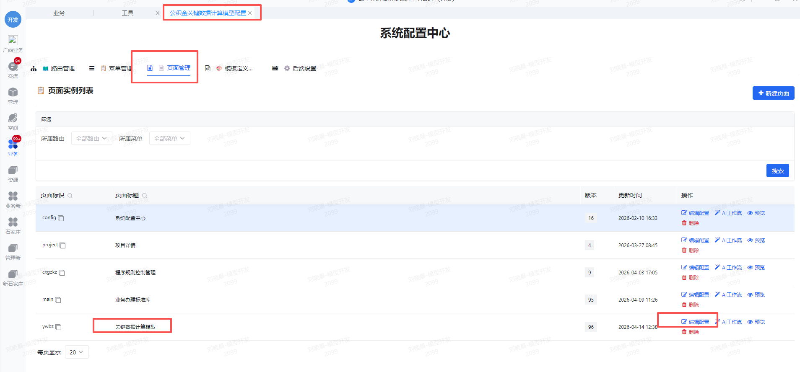
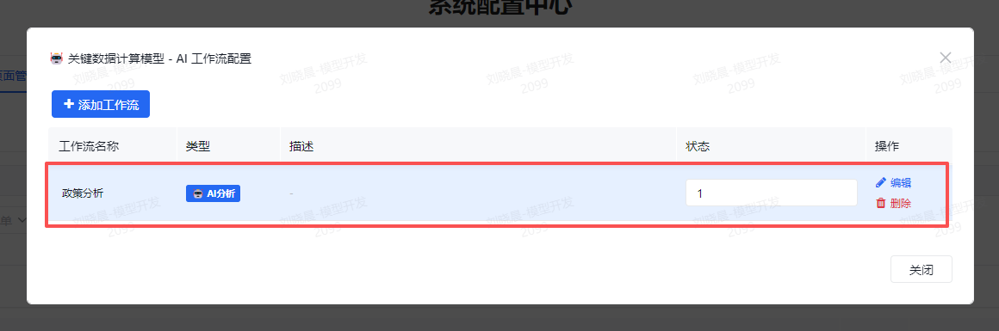
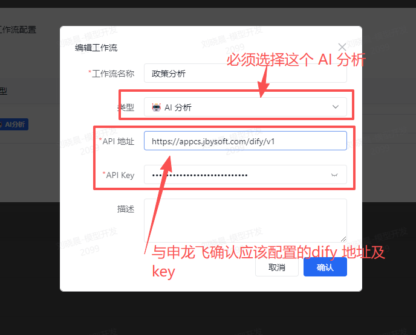

%% Word 目录已内置在下方，不要再额外加 --toc。 %%

**交付手册**

| 项目 | 内容 | 项目 | 内容 |
|----|----|----|----|
| 文件编号 | `{项目编号}` / `{文件编号}` | 文件状态 | `[ ] 草稿  [x] 正式发布  [ ] 正在修改` |
| 当前版本 | `V1.0` | 发布日期 | `2026-04-15` |
| 拟制 | `项目组` | 日期 | `2026-04-15` |
| 审核 | `以正式审批记录为准` | 日期 | `以正式审批记录为准` |
| 批准 | `以正式审批记录为准` | 日期 | `以正式审批记录为准` |

**修订历史记录**

| 变更版本号 | 日期 | 变更类型(A/M/D) | 修改人 | 摘要 | 备注 |
|----|----|----|----|----|----|
| `V1.0` | `2026-04-15` | `A` | `项目组` | 首次整理关键数据算法 260415 公版更新说明，汇总程序镜像升级与数据库脚本升级内容 | 初版 |
|  |  |  |  |  |  |
|  |  |  |  |  |  |
|  |  |  |  |  |  |
|  |  |  |  |  |  |

> 说明：`A` 表示增加，`M` 表示修改，`D` 表示删除。后续版本调整时，仅需补充本页修订记录。

**目录**

```{=openxml}
<w:sdt>
  <w:sdtPr>
    <w:docPartObj>
      <w:docPartGallery w:val="Table of Contents"/>
      <w:docPartUnique/>
    </w:docPartObj>
  </w:sdtPr>
  <w:sdtContent>
    <w:p>
      <w:r>
        <w:fldChar w:fldCharType="begin" w:dirty="true"/>
        <w:instrText xml:space="preserve">TOC \\o "1-4" \\h \\z \\u</w:instrText>
        <w:fldChar w:fldCharType="separate"/>
        <w:fldChar w:fldCharType="end"/>
      </w:r>
    </w:p>
  </w:sdtContent>
</w:sdt>
```

## 一、更新说明

本文用于作为关键数据算法首次公共更新说明，共包含两部分内容：
1. 程序镜像升级说明
2. 业务标准升级相关数据库脚本说明

本次更新所使用的程序与《程序规则控制管理部署及使用手册》对应程序为同一套程序，镜像仓库和镜像名称保持一致，仅更新交付版本；当前 `业务标准升级方案` 已整理到改造点 14，本说明的数据库脚本清单以本次 260415 交付已确认脚本为边界，重点覆盖已确认交付脚本涉及的数据库、存储过程和结构扩展内容，并说明改造点 13、14 的实施边界，便于现场统一实施。

| 关注项     | 说明                         |
| ------- | -------------------------- |
| 程序镜像升级  | 说明本次交付镜像版本、校验值和升级方式        |
| 数据库脚本升级 | 说明已上线库和新建库对应脚本             |
| 存储过程调整  | 说明改造点 6 的单独执行要求            |
| 基础数据初始化 | 说明 `gjj_ywnrfl` 分类基础数据补充方式 |
| 上线验收    | 说明镜像升级后和脚本执行后的核对步骤         |
| 备份回滚    | 说明升级前备份项与版本回退方法            |

## 二、版本与交付信息

### 1. 程序镜像版本信息

| 项目 | 内容 | 备注 |
|----|----|----|
| 交付模块 | `关键数据算法260415更新` | 本次公版更新交付说明 |
| 文档版本 | `V1.0` | 与本说明版本一致 |
| 交付日期 | `2026-04-15` | 按本次整理日期填写 |
| 镜像仓库 | `harbor.sjgjj.cn:10443/gjjrgzn` | 与原程序交付仓库一致 |
| 镜像名称 | `damoxing` | 与原程序交付镜像名一致 |
| 镜像 Tag | `202605201736-gjsj` | 本次统一交付镜像 tag |
| 镜像适配架构 | `linux/amd64`、`linux/arm64` | 同时支持 x86 与 ARM |
| 最终定版校验值 | `以正式交付镜像校验结果为准` | 多架构 OCI Image Index Digest |
| 镜像摘要/校验方式 | `以多架构 OCI Image Index Digest 为准` | 平台级 digest 见下表 |
| 适用环境 | `测试 / 生产` | 本次交付适用环境 |

> 交付建议：正式交付时，除镜像 tag 外，还应补充最上层 OCI Image Index 的 digest，作为最终定版校验值。平台级 digest 仅用于区分 `amd64` 与 `arm64` 明细，不替代最终定版校验值。

### 1.1 平台明细表

| 平台 | Manifest Digest | 用途说明 |
|----|----|----|
| `linux/amd64` | `以正式交付镜像校验结果为准` | x86_64 服务器使用 |
| `linux/arm64` | `以正式交付镜像校验结果为准` | ARM64 服务器使用 |

说明：

- 上表仅列出实际运行平台对应的 manifest digest。
- `unknown/unknown` 类型为 attestation manifest，不作为交付运行平台校验项。

### 1.2 镜像验证命令

| 验证项 | 命令 | 说明 |
|----|----|----|
| 查看多架构镜像清单 | `docker buildx imagetools inspect harbor.sjgjj.cn:10443/gjjrgzn/damoxing:202605201736-gjsj` | 查看总 digest、平台列表与平台 digest |
| 提取最终定版校验值 | `docker buildx imagetools inspect harbor.sjgjj.cn:10443/gjjrgzn/damoxing:202605201736-gjsj` | 读取输出最上方 `Digest: sha256:...` 作为最终交付校验值 |
| 验证 x86 平台拉取 | `docker pull --platform linux/amd64 harbor.sjgjj.cn:10443/gjjrgzn/damoxing:202605201736-gjsj` | 用于 AMD64 服务器验收 |
| 验证 ARM 平台拉取 | `docker pull --platform linux/arm64 harbor.sjgjj.cn:10443/gjjrgzn/damoxing:202605201736-gjsj` | 用于 ARM64 服务器验收 |
| 查看本地镜像 RepoDigest | `docker inspect --format='{{index .RepoDigests 0}}' harbor.sjgjj.cn:10443/gjjrgzn/damoxing:202605201736-gjsj` | 核对本地拉取后 digest |

### 2. 交付清单

| 文件                        | 用途                   | 是否必须                 |
| ------------------------- | -------------------- | -------------------- |
| 程序镜像                      | 本次关键数据算法公版更新程序本体     | `是`                  |
| `docker-compose.yml`      | 启动编排文件               | `是`                  |
| `data/database.sqlite`    | 程序基础数据               | `否`，新建环境必须。已有环境不需要更新 |
| `config/datasources.json` | 业务库连接配置              | `是`                  |
| 对应数据库升级脚本                 | 已上线库增量升级             | `是`，按数据库类型执行         |
| 对应数据库初始化脚本                | 新建库初始化               | `是`，按数据库类型执行         |
| 分类基础数据脚本                  | `gjj_ywnrfl` 基础数据初始化 | `是`                  |
| 本说明                       | 交付说明                 | `是`                  |

## 三、本次更新内容汇总

### 1. 程序镜像更新说明

本次程序镜像更新与《程序规则控制管理部署及使用手册》对应程序为同一套程序，交付口径如下：

- 镜像仓库保持 `harbor.sjgjj.cn:10443/gjjrgzn` 不变。
- 镜像名称保持 `damoxing` 不变。
- 本次仅升级镜像版本到 `202605201736-gjsj`。
- 部署方式仍沿用现场原 `docker-compose.yml` 与 `datasources.json` 挂载方式。
- 升级前需先完成数据库脚本执行和配置核对，再执行镜像更新。

### 2. 改造点对应说明与本次交付边界

| 改造点                          | 是否涉及数据库脚本 | 已上线库执行脚本                                         | 新建库初始化脚本                                     | 备注                                 |
| ---------------------------- | --------- | ------------------------------------------------ | -------------------------------------------- | ---------------------------------- |
| 1. 关键数据算法下拉改为本地 JSON 配置      | 否         | 无                                                | 无                                            | 无                                  |
| 2. 业务内容分类改为自有维护并通过自有接口取值     | 是         | 对应数据库的 `upgrade_business_standards_online_*.sql` | 对应数据库的 `init_business_standards_*.sql`       | 新增 `gjj_ywnrfl` 表，用于按关键算法维护业务内容分类。 |
| 3. 标准库新增自定义编码字段              | 是         | 对应数据库的 `upgrade_business_standards_online_*.sql` | 对应数据库的 `init_business_standards_*.sql`       | 无                                  |
| 4. 标准库新增业务办理分类字段并优化新增、修改页面展示 | 是         | 对应数据库的 `upgrade_business_standards_online_*.sql` | 对应数据库的 `init_business_standards_*.sql`       | 无                                  |
| 5. 业务办理标准支持配置互斥关系            | 是         | 对应数据库的 `upgrade_business_standards_online_*.sql` | 对应数据库的 `init_business_standards_*.sql`       | 上线后还需初始化互斥表数据。                     |
| 6. 关键数据算法按不同子存储过程执行          | 是，存储过程/函数 | 按数据库类型执行 `https://svn.sjgjj.cn/svn/CustomerProject/Shineyue/MXSJ/GJJYW/关键数据算法/业务脚本/` 下对应脚本 | 按数据库类型执行 `https://svn.sjgjj.cn/svn/CustomerProject/Shineyue/MXSJ/GJJYW/关键数据算法/业务脚本/` 下对应脚本 | 以 SVN 交付目录 `https://svn.sjgjj.cn/svn/CustomerProject/Shineyue/MXSJ/GJJYW/关键数据算法` 中的正式脚本和执行顺序说明为准。 |
| 7. 第三方程序对接范围补齐               | 否         | 无                                                | 无                                            | 无                                  |
| 8. 业务办理标准值在清册选择列表中按 X 占位反显   | 是         | 对应数据库的 `upgrade_business_standards_online_*.sql` | 对应数据库的 `init_business_standards_*.sql`       | 无                                  |
| 9. 调试功能支持业务参数自动生成及成功案例保存反显   | 是         | 对应数据库的 `upgrade_business_standards_online_*.sql` | 对应数据库的 `init_business_standards_*.sql`       | 无                                  |
| 10. 标准库新增提示语属性名称和提示语属性单位     | 是         | 对应数据库的 `upgrade_business_standards_online_*.sql` | 对应数据库的 `init_business_standards_*.sql`       | 无                                  |
| 11. 标准库属性组支持自定义属性录入          | 否         | 无                                                | 无                                            | 无                                  |
| 12. 业务规则页面新增 AI 政策分析辅助清册勾选   | 否         | 无                                                | 无                                            | 无                                  |
| 13. 业务规则页面支持查看关键数据算法应用位置    | 否         | 本次 260415 数据库脚本不涉及                         | 本次 260415 数据库脚本不涉及                       | 程序侧已包含页面入口和后端接口；实际可用依赖第三方网关接口、登录 token、机构头信息和现场网关连通性。 |
| 14. 提取自动化风控引擎算法及风险分类能力扩展    | 是         | 对应数据库的 `upgrade_business_standards_online_*.sql` | 对应数据库的 `init_business_standards_*.sql`       | 已包含 `gjj_ywnrfl.quanzhong`、`gjj_ywbzk.fenzhi` 和 `ywblfl=3` 风险分类语义扩展；完整风控评分、判定执行链路需结合现场业务规则配置和后续引擎实现确认。 |

> 边界说明：当前项目方案已整理到改造点 14。本次 `关键数据算法260415更新` 已包含改造点 13 的程序入口和后端接口，改造点 13 不涉及数据库 DDL，现场可用性取决于第三方网关接口、登录 token、机构头信息和网络连通性；本次业务标准升级脚本已包含改造点 14 的数据库字段、页面维护和保存接口所需结构扩展，但完整风控评分、判定执行链路不在本说明中展开，需结合现场业务规则配置和后续引擎实现确认。

> 算法配置说明：当前程序关键数据算法配置中还包含编码 `20` 的 `提取流程推送规则`。该项属于当前程序算法配置项，不作为 `业务标准升级方案` 中新的改造点编号单独展开；现场验收时如在关键数据算法下拉中看到该算法，属于正常配置。

## 四、数据库脚本执行说明

### 1. 已上线旧库执行脚本

已存在业务标准相关基础表的环境，优先执行各数据库对应的升级脚本：

- Oracle：`https://svn.sjgjj.cn/svn/CustomerProject/Shineyue/MXSJ/GJJYW/关键数据算法/程序脚本/oracle/更新/upgrade_business_standards_online_oracle.sql`
- 达梦：`https://svn.sjgjj.cn/svn/CustomerProject/Shineyue/MXSJ/GJJYW/关键数据算法/程序脚本/达梦/更新/upgrade_business_standards_online_dm.sql`
- PostgreSQL：`https://svn.sjgjj.cn/svn/CustomerProject/Shineyue/MXSJ/GJJYW/关键数据算法/程序脚本/postgresql/更新/upgrade_business_standards_online_pg.sql`
- GaussDB：`https://svn.sjgjj.cn/svn/CustomerProject/Shineyue/MXSJ/GJJYW/关键数据算法/程序脚本/高斯/更新/upgrade_business_standards_online_gauss.sql`
- 人大金仓：`https://svn.sjgjj.cn/svn/CustomerProject/Shineyue/MXSJ/GJJYW/关键数据算法/程序脚本/人大金仓/更新/upgrade_business_standards_online_kingbase.sql`

上述脚本当前主要覆盖改造点 `2、3、4、5、8、9、10、14` 中涉及表结构和字段扩展的内容，脚本均按“对象不存在才创建、字段不存在才新增”思路整理，可用于已上线库增量升级。

### 2. 新建环境初始化脚本

如果是新建库或初始化部署，可直接执行各数据库对应的初始化脚本：

- Oracle：`https://svn.sjgjj.cn/svn/CustomerProject/Shineyue/MXSJ/GJJYW/关键数据算法/程序脚本/oracle/初始化/init_business_standards_oracle.sql`
- 达梦：`https://svn.sjgjj.cn/svn/CustomerProject/Shineyue/MXSJ/GJJYW/关键数据算法/程序脚本/达梦/初始化/init_business_standards_dm.sql`
- PostgreSQL：`https://svn.sjgjj.cn/svn/CustomerProject/Shineyue/MXSJ/GJJYW/关键数据算法/程序脚本/postgresql/初始化/init_business_standards_pg.sql`
- GaussDB：`https://svn.sjgjj.cn/svn/CustomerProject/Shineyue/MXSJ/GJJYW/关键数据算法/程序脚本/高斯/首次部署执行初始化/init_business_standards_gauss.sql`
- 人大金仓：`https://svn.sjgjj.cn/svn/CustomerProject/Shineyue/MXSJ/GJJYW/关键数据算法/程序脚本/人大金仓/首次部署执行初始化/init_business_standards_kingbase.sql`

初始化脚本包含当前业务标准主流程所需核心表结构，适用于全新环境一次性建表。

> 配置路径说明：源码仓库中的数据源配置模板位于 `server/config/datasources.json`；正式部署目录使用 `config/datasources.json`，并通过容器编排挂载到容器内 `/app/config/datasources.json`。

### 3. 存储过程与基础数据补充脚本

改造点 `6` 属于存储过程/函数层升级，不在上述“业务标准升级脚本”主表结构范围内，需按数据库类型额外执行过程脚本。

改造点 `2` 的业务内容分类表 `gjj_ywnrfl` 建表后，还需要补齐基础数据。现场需补执行如下脚本：

- 业务内容分类基础数据--oracle：`https://svn.sjgjj.cn/svn/CustomerProject/Shineyue/MXSJ/GJJYW/关键数据算法/程序脚本/oracle/基础数据/seed_ywnrfl_gjsjsf_1_oracle.sql`
- 业务内容分类基础数据--达梦：`https://svn.sjgjj.cn/svn/CustomerProject/Shineyue/MXSJ/GJJYW/关键数据算法/程序脚本/达梦/基础数据/seed_ywnrfl_gjsjsf_1_dm.sql`
- 业务内容分类基础数据--postgresql：`https://svn.sjgjj.cn/svn/CustomerProject/Shineyue/MXSJ/GJJYW/关键数据算法/程序脚本/postgresql/基础数据/seed_ywnrfl_gjsjsf_1_pg.sql`
- 业务内容分类基础数据--人大金仓：`https://svn.sjgjj.cn/svn/CustomerProject/Shineyue/MXSJ/GJJYW/关键数据算法/程序脚本/人大金仓/基础数据/seed_ywnrfl_gjsjsf_1_kingbase.sql`
- 业务内容分类基础数据--高斯：`https://svn.sjgjj.cn/svn/CustomerProject/Shineyue/MXSJ/GJJYW/关键数据算法/程序脚本/高斯/基础数据/seed_ywnrfl_gjsjsf_1_gauss.sql`

> 注意：当前 SVN 目录如未单独提供 `基础数据` 目录，请先确认交付包中对应 `seed_ywnrfl_*` 脚本已纳入正式清单后再执行；不要在未确认基础数据脚本版本时手工拼接执行。

### 4. 分数据库执行建议

#### 4.1 Oracle

建议执行顺序：

1. 已上线库先执行 `https://svn.sjgjj.cn/svn/CustomerProject/Shineyue/MXSJ/GJJYW/关键数据算法/程序脚本/oracle/更新/upgrade_business_standards_online_oracle.sql`
2. 新环境如需初始化，执行 `https://svn.sjgjj.cn/svn/CustomerProject/Shineyue/MXSJ/GJJYW/关键数据算法/程序脚本/oracle/初始化/init_business_standards_oracle.sql`
3. 涉及改造点 6，先执行 `https://svn.sjgjj.cn/svn/CustomerProject/Shineyue/MXSJ/GJJYW/关键数据算法/业务脚本/oracle/update_table_gjsjsf_oracle.sql`，再执行 `https://svn.sjgjj.cn/svn/CustomerProject/Shineyue/MXSJ/GJJYW/关键数据算法/业务脚本/oracle/update_proc_gjsjsf_oracle.sql`
4. 涉及改造点 2 的分类基础数据，再补执行 `https://svn.sjgjj.cn/svn/CustomerProject/Shineyue/MXSJ/GJJYW/关键数据算法/程序脚本/oracle/基础数据/seed_ywnrfl_gjsjsf_1_oracle.sql`

#### 4.2 达梦

建议执行顺序：

1. 已上线库先执行 `https://svn.sjgjj.cn/svn/CustomerProject/Shineyue/MXSJ/GJJYW/关键数据算法/程序脚本/达梦/更新/upgrade_business_standards_online_dm.sql`
2. 新环境如需初始化，执行 `https://svn.sjgjj.cn/svn/CustomerProject/Shineyue/MXSJ/GJJYW/关键数据算法/程序脚本/达梦/初始化/init_business_standards_dm.sql`
3. 涉及改造点 6，按 `https://svn.sjgjj.cn/svn/CustomerProject/Shineyue/MXSJ/GJJYW/关键数据算法/业务脚本/达梦/执行顺序说明.txt` 执行：先执行 `table_dm.sql`，再执行 `f_gjj_get_sql_by_dialect_dm.txt`，然后执行 `p_gjj_get_mxywsfz_1.txt`、`p_gjj_get_mxywsfz_2.txt`、`p_gjj_get_mxywsfz_3.txt`、`p_gjj_get_mxywsfz.txt`，最后执行 `p_gjj_get_mxywnrxx.txt`
4. 涉及改造点 2 的分类基础数据，再补执行 `https://svn.sjgjj.cn/svn/CustomerProject/Shineyue/MXSJ/GJJYW/关键数据算法/程序脚本/达梦/基础数据/seed_ywnrfl_gjsjsf_1_dm.sql`
5. 如果现场历史表主键仍存在 `IDENTITY` 兼容问题，可视情况执行 `https://svn.sjgjj.cn/svn/CustomerProject/Shineyue/MXSJ/GJJYW/关键数据算法/程序脚本/达梦/更新/migrate_dm_identity_to_auto_increment.sql`；如 SVN 目录暂未提供该脚本，需先补齐后执行

#### 4.3 PostgreSQL

建议执行顺序：

1. 已上线库先执行 `https://svn.sjgjj.cn/svn/CustomerProject/Shineyue/MXSJ/GJJYW/关键数据算法/程序脚本/postgresql/更新/upgrade_business_standards_online_pg.sql`
2. 新环境如需初始化，执行 `https://svn.sjgjj.cn/svn/CustomerProject/Shineyue/MXSJ/GJJYW/关键数据算法/程序脚本/postgresql/初始化/init_business_standards_pg.sql`
3. 涉及改造点 6 的过程执行链路，先执行 `https://svn.sjgjj.cn/svn/CustomerProject/Shineyue/MXSJ/GJJYW/关键数据算法/业务脚本/postgresql/init_pg_family_db_format_pg.sql`，再执行 `https://svn.sjgjj.cn/svn/CustomerProject/Shineyue/MXSJ/GJJYW/关键数据算法/业务脚本/postgresql/init_pg_family_calc_objects_common.sql`
4. 涉及改造点 2 的分类基础数据，再补执行 `https://svn.sjgjj.cn/svn/CustomerProject/Shineyue/MXSJ/GJJYW/关键数据算法/程序脚本/postgresql/基础数据/seed_ywnrfl_gjsjsf_1_pg.sql`

> 当前 SVN 目录如未包含 `https://svn.sjgjj.cn/svn/CustomerProject/Shineyue/MXSJ/GJJYW/关键数据算法/业务脚本/postgresql/`，需先补齐该目录下的 `init_pg_family_db_format_pg.sql` 和 `init_pg_family_calc_objects_common.sql` 后再执行。

#### 4.4 GaussDB

建议执行顺序：

1. 已上线库先执行 `https://svn.sjgjj.cn/svn/CustomerProject/Shineyue/MXSJ/GJJYW/关键数据算法/程序脚本/高斯/更新/upgrade_business_standards_online_gauss.sql`
2. 新环境如需初始化，执行 `https://svn.sjgjj.cn/svn/CustomerProject/Shineyue/MXSJ/GJJYW/关键数据算法/程序脚本/高斯/首次部署执行初始化/init_business_standards_gauss.sql`
3. 涉及改造点 6，先执行 `https://svn.sjgjj.cn/svn/CustomerProject/Shineyue/MXSJ/GJJYW/关键数据算法/业务脚本/高斯/init_pg_family_db_format_gauss.sql`，再执行 `https://svn.sjgjj.cn/svn/CustomerProject/Shineyue/MXSJ/GJJYW/关键数据算法/业务脚本/高斯/init_pg_family_calc_objects_common.sql`，最后执行 `https://svn.sjgjj.cn/svn/CustomerProject/Shineyue/MXSJ/GJJYW/关键数据算法/业务脚本/高斯/init_pg_family_calc_objects_gauss_compat.sql`
4. 涉及改造点 2 的分类基础数据，再补执行 `https://svn.sjgjj.cn/svn/CustomerProject/Shineyue/MXSJ/GJJYW/关键数据算法/程序脚本/高斯/基础数据/seed_ywnrfl_gjsjsf_1_gauss.sql`

> 当前 SVN 目录如未包含 `https://svn.sjgjj.cn/svn/CustomerProject/Shineyue/MXSJ/GJJYW/关键数据算法/业务脚本/高斯/`，需先补齐该目录下的 `init_pg_family_db_format_gauss.sql`、`init_pg_family_calc_objects_common.sql` 和 `init_pg_family_calc_objects_gauss_compat.sql` 后再执行。

#### 4.5 人大金仓

建议执行顺序：

1. 已上线库先执行 `https://svn.sjgjj.cn/svn/CustomerProject/Shineyue/MXSJ/GJJYW/关键数据算法/程序脚本/人大金仓/更新/upgrade_business_standards_online_kingbase.sql`
2. 新环境如需初始化，执行 `https://svn.sjgjj.cn/svn/CustomerProject/Shineyue/MXSJ/GJJYW/关键数据算法/程序脚本/人大金仓/首次部署执行初始化/init_business_standards_kingbase.sql`
3. 涉及改造点 6，按 `https://svn.sjgjj.cn/svn/CustomerProject/Shineyue/MXSJ/GJJYW/关键数据算法/业务脚本/人大金仓/执行顺序说明.txt` 执行：先执行 `table.txt`，再执行 `f_gjj_get_sql_by_dialect_pg.sql`，然后执行 `p_gjj_get_mxywsfz_1.txt`、`p_gjj_get_mxywsfz_2.txt`、`p_gjj_get_mxywsfz_3.txt`、`p_gjj_get_mxywsfz.txt`，最后执行 `p_gjj_get_mxywnrxx.txt`
4. 涉及改造点 2 的分类基础数据，再补执行 `https://svn.sjgjj.cn/svn/CustomerProject/Shineyue/MXSJ/GJJYW/关键数据算法/程序脚本/人大金仓/基础数据/seed_ywnrfl_gjsjsf_1_kingbase.sql`
### 5. 重点注意事项

- 改造点 `3` 的 `zdybm` 唯一索引创建前，需先检查历史数据是否有重复非空编码，否则升级脚本可能执行失败。
- 改造点 `4` 的 `ywblfl` 默认值建议统一为 `1`，升级后需确认历史空值是否已补齐。
- 改造点 `2` 虽然建表脚本已包含 `gjj_ywnrfl`，但业务可用还依赖分类基础数据初始化。
- 改造点 `6` 属于存储过程层改造，不能只执行表结构脚本，需要配套执行过程/函数脚本。
- 改造点 `8` 按仓库当前 SQL 实现，已在升级脚本中补充 `gjj_ywbz.ywbzz` 字段，现场应以实际脚本为准。
- 改造点 `12` 不新增业务标准专用表，但依赖现有 AI 工作流配置能力，需提前确认 `sys_dify_config` 及页面级配置链路可用。
-  已部署的环境，更新程序后需要在 `运维服务商` ->`公积金关键数据计算模型配置`->`页面管理` ->`关键数据计算模型` ->`编辑配置`->`下一步` ->`保存` （说明无需修改任何内容，仅用于页面样式更新）
- 新建及已部署环境，启动程序后需要在`运维服务商` ->`公积金关键数据计算模型配置`->`页面管理` ->`关键数据计算模型` ->`AI 工作流`->`添加工作流` 或 `编辑` ->`确认`

## 五、升级实施步骤

### 1. 推荐实施顺序

建议现场统一按以下顺序实施：

1. 先备份当前生产 `docker-compose.yml`、`data/database.sqlite`、`config/datasources.json` 和相关业务表。
2. 先判断是“已上线旧库升级”还是“新环境初始化”，执行对应数据库主脚本。
3. 再执行改造点 `6` 的过程脚本及改造点 `2` 的基础数据脚本。
4. 核对数据库对象、字段和基础数据无误后，再更新程序镜像版本。
5. 最后按本说明的重点注意事项逐项执行。

### 2. 程序镜像升级命令

> 说明：当前交付编排中的主应用服务名为 `app`。如现场调整过 `docker-compose.yml` 服务名，请按现场实际服务名替换以下命令中的 `app`。

| 步骤 | 命令 | 说明 |
|----|----|----|
| 进入部署目录 | `cd /opt/damoxing` | 以现场实际部署目录为准 |
| 校验目标镜像 | `docker buildx imagetools inspect harbor.sjgjj.cn:10443/gjjrgzn/damoxing:202605201736-gjsj` | 升级前先核对 tag 与 digest |
| 拉取新版本镜像 | `docker compose -f docker-compose.yml pull app` | 前提是编排文件已更新到本次镜像版本 |
| 重建并启动服务 | `docker compose -f docker-compose.yml up -d` | 按交付包中的最终编排文件执行 |
| 查看容器状态 | `docker compose -f docker-compose.yml ps` | 确认服务已启动 |
| 查看后端日志 | `docker compose -f docker-compose.yml logs -f app` | 用于排查启动问题 |
| 进入后端容器 | `docker compose -f docker-compose.yml exec app sh` | 进入程序容器排查配置或执行检查 |

### 3. 配置核对项

| 检查项                       | 说明                             |
| ------------------------- | ------------------------------ |
| `config/datasources.json` | 确认现场数据源配置未被旧版本覆盖               |
| `data/database.sqlite`    | 仅新建环境时添加                       |
| `docker-compose.yml`      | 确认镜像地址、tag、卷挂载和服务名配置正确         |
| AI 配置链路                   | 涉及改造点 `12`，需确认 `dify` 地址从容器可调用 |

## 六、上线后验证方法

### 1. 运维命令检查

| 验证项 | 命令 | 预期结果 |
|----|----|----|
| 容器状态 | `docker compose -f docker-compose.yml ps` | 服务均为运行状态 |
| 后端日志 | `docker compose -f docker-compose.yml logs -f app` | 无明显报错 |
| 镜像版本 | `docker inspect --format='{{index .RepoDigests 0}}' harbor.sjgjj.cn:10443/gjjrgzn/damoxing:202605201736-gjsj` | 与本次交付 digest 一致 |
| 数据对象检查 | 按数据库查看新增表、字段、索引、过程是否已生效 | 脚本执行成功 |

### 2. 业务验收检查

| 验证项 | 验证内容 |
|----|----|
| 下拉配置验证 | 关键数据算法下拉已改为本地 JSON 配置并可正常使用 |
| 业务内容分类验证 | `gjj_ywnrfl` 分类可维护且接口取值正常 |
| 自定义编码验证 | 标准库新增、修改时可维护 `zdybm` 且无重复数据异常 |
| 业务办理分类验证 | 新增、修改页面可展示并保存 `ywblfl` |
| 互斥关系验证 | 标准支持维护互斥关系并可正常生效 |
| 存储过程验证 | 关键数据算法可按不同子存储过程正确执行 |
| 标准值反显验证 | 业务办理标准值在清册选择列表中可按 `X` 占位正确反显 |
| 调试功能验证 | 业务参数自动生成、成功案例保存和反显功能正常 |
| 提示语属性验证 | 提示语属性名称、提示语属性单位可正常维护和展示 |
| AI 辅助清册验证 | 业务规则页面 AI 政策分析辅助清册勾选功能正常 |

## 七、备份与回滚说明

### 1. 执行前备份建议

| 备份项 | 建议方式 |
|----|----|
| 程序编排文件 | 备份当前 `docker-compose.yml` |
| 程序配置 | 备份 `.env` 与 `config/datasources.json` |
| 业务标准相关表 | 由 DBA 备份升级涉及表及过程定义 |
| 历史镜像版本 | 记录当前线上镜像 tag 和 RepoDigest |

### 2. 回滚建议

| 场景 | 回滚方式 |
|----|----|
| 程序版本错误 | 将 `docker-compose.yml` 切回上一个定版镜像 tag，并重新 `docker compose up -d` |
| 配置文件错误 | 恢复备份的 `.env` 和 `config/datasources.json` |
| 数据库结构问题 | 由 DBA 按现场规范回滚表结构、过程和基础数据 |
| 单项脚本执行异常 | 停止继续升级，先核对历史数据和对象状态，再按数据库类型单独修复 |

## 八、交付结论

本次“关键数据算法 260415 公版更新”已将程序镜像升级内容和业务标准数据库脚本升级内容汇总到同一份说明中，现场实施时建议统一按照“先数据库、后镜像、再验收”的口径执行。

如后续镜像 tag、digest 或数据库脚本有再次调整，仅需同步更新本说明中的版本信息、执行脚本和修订历史记录。
