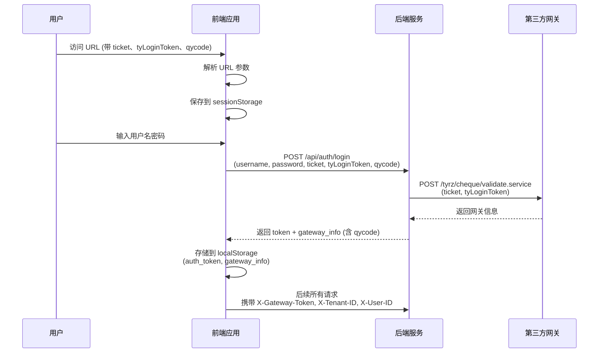

# URL 参数模式网关集成说明

## 使用方式

### URL 格式

应用需要通过以下格式的 URL 访问，携带网关参数：

```
https://your-domain/gjjrgzn/login?ticket=xxx&tyLoginToken=xxx&qycode=xxx
```

### 参数说明

| 参数 | 必填 | 说明 | 示例 |
|------|------|------|------|
| `ticket` | 是 | 网关验证票据 | `tyrz1b7cf1ae2abc4c5faa15680ae2abe0fb` |
| `tyLoginToken` | 是 | 网关登录令牌 | `24b0d49d1c7c4e10bc05096fb85a04d724:zmd` |
| `qycode` | 否 | 企业代码（保存供后续使用） | `2506031` |

### 完整示例 URL

```
https://appcs.jbysoft.com/gjjrgzn/login?ticket=tyrz1b7cf1ae2abc4c5faa15680ae2abe0fb&qycode=2506031&tyLoginToken=24b0d49d1c7c4e10bc05096fb85a04d724:zmd
```

---

## 工作流程

### 流程图



### 详细步骤

#### 1. 前端接收 URL 参数

**文件**: [`client/src/utils/urlParams.ts`](file:///Users/xiaochen/Downloads/damoxing/client/src/utils/urlParams.ts)

```typescript
// 从 URL 获取参数
const gatewayParams = getGatewayParamsWithFallback();
// => { ticket: '...', tyLoginToken: '...', qycode: '...' }
```

**功能**:
- 自动从 URL 查询参数中提取 `ticket`、`tyLoginToken`、`qycode`
- 保存到 `sessionStorage`（防止页面刷新丢失）
- 读取时优先使用 URL 参数，其次使用 sessionStorage

#### 2. 登录时发送给后端

**文件**: [`client/src/pages/Login.tsx`](file:///Users/xiaochen/Downloads/damoxing/client/src/pages/Login.tsx)

```typescript
const response = await axios.post(`/gjjrgzn/api/auth/login`, {
  username,
  password,
  ticket: gatewayParams.ticket,
  tyLoginToken: gatewayParams.tyLoginToken,
  qycode: gatewayParams.qycode
});
```

#### 3. 后端调用网关

**文件**: [`server/routes/http/auth.js`](file:///Users/xiaochen/Downloads/damoxing/server/routes/http/auth.js)

```javascript
// 使用前端传来的参数，环境变量作为兜底
const finalTicket = ticket || process.env.GATEWAY_TICKET;
const finalLoginToken = tyLoginToken || process.env.GATEWAY_LOGIN_TOKEN;

const formData = new FormData();
formData.append('ticket', finalTicket);
formData.append('loginToken', finalLoginToken);

const response = await axios.post(gatewayUrl, formData);
```

#### 4. 返回网关信息

```json
{
  "status": 0,
  "data": {
    "token": "jwt_token",
    "user": { ... },
    "gateway_info": {
      "gateway_token": "...",
      "tenant_id": "...",
      "user_id": "...",
      "qycode": "2506031"
    }
  }
}
```

#### 5. 前端存储并透传

```typescript
// 存储 gateway_info 到 localStorage
localStorage.setItem('gateway_info', JSON.stringify(gateway_info));

// 所有后续请求自动携带（fetcher.ts 自动处理）
headers['X-Gateway-Token'] = gateway_info.gateway_token;
headers['X-Tenant-ID'] = gateway_info.tenant_id;
headers['X-User-ID'] = gateway_info.user_id;
```

---

## 测试场景

### 场景 1: 带参数访问（正常流程）

#### 访问 URL
```
http://localhost:3000/gjjrgzn/login?ticket=tyrz1b7cf&tyLoginToken=24b0d&qycode=2506031
```

#### 预期结果
1. ✅ 页面加载后，控制台不报错
2. ✅ sessionStorage 中保存了参数
3. ✅ 输入 `admin / admin123` 登录
4. ✅ 后端日志显示网关调用（ticket 和 tyLoginToken）
5. ✅ localStorage 中保存了 gateway_info（包含 qycode）
6. ✅ 登录成功跳转到首页

### 场景 2: 不带参数访问（降级模式）

#### 访问 URL
```
http://localhost:3000/gjjrgzn/login
```

#### 预期结果
1. ✅ 正常加载登录页
2. ✅ 登录时使用环境变量中的 `GATEWAY_TICKET` 和 `GATEWAY_LOGIN_TOKEN`
3. ✅ 或者网关返回模拟数据（如果 `GATEWAY_ENABLED=false`）
4. ✅ 仍然可以成功登录

### 场景 3: 刷新页面后参数保持

#### 操作步骤
1. 访问 `http://localhost:3000/gjjrgzn/login?ticket=xxx&tyLoginToken=xxx&qycode=xxx`
2. 刷新页面（F5）

#### 预期结果
1. ✅ URL 参数可能丢失
2. ✅ 但 sessionStorage 仍保留参数
3. ✅ 登录时仍能正确发送网关参数

---

## 调试方法

### 查看 URL 参数是否正确读取

打开浏览器控制台（F12），执行：

```javascript
// 查看 sessionStorage
console.log(sessionStorage.getItem('gateway_url_params'));
// 应该看到: {"ticket":"...","tyLoginToken":"...","qycode":"..."}
```

### 查看登录请求是否携带参数

Network 标签中，找到 `/gjjrgzn/api/auth/login` 请求，查看 Request Payload：

```json
{
  "username": "admin",
  "password": "admin123",
  "ticket": "tyrz1b7cf1ae2abc4c5faa15680ae2abe0fb",
  "tyLoginToken": "24b0d49d1c7c4e10bc05096fb85a04d724:zmd",
  "qycode": "2506031"
}
```

### 查看后端网关调用日志

```bash
# 查看服务器日志
cd server && npm start

# 登录时应该看到：
[Gateway] 调用网关验证接口: https://appsy.jbysoft.com/tyrz/cheque/validate.service
[Gateway] 参数: ticket=tyrz1b7cf1..., tyLoginToken=24b0d49d1c...
[Gateway] 网关响应: {...}
```

### 查看存储的网关信息

浏览器控制台：

```javascript
console.log(JSON.parse(localStorage.getItem('gateway_info')));
// 应该看到:
{
  gateway_token: "...",
  tenant_id: "...",
  user_id: "...",
  qycode: "2506031"
}
```

---

## 配置选项

### 开发环境（不调用真实网关）

```bash
# server/.env
GATEWAY_ENABLED=false
```

登录时使用模拟数据，不实际调用网关 API。

### 开发环境（使用固定参数）

```bash
# server/.env
GATEWAY_ENABLED=true
GATEWAY_TICKET=your-dev-ticket
GATEWAY_LOGIN_TOKEN=your-dev-token
```

URL 不带参数时，使用这些固定值。

### 生产环境

```bash
# .env.production
GATEWAY_ENABLED=true
# 不设置 GATEWAY_TICKET 和 GATEWAY_LOGIN_TOKEN
# 强制必须从 URL 获取
```

---

## 常见问题

### Q1: URL 参数丢失怎么办？
**A**: 参数已保存到 sessionStorage，刷新页面后仍可用。

### Q2: 网关调用失败会影响登录吗？
**A**: 不会。网关失败时返回降级数据，登录仍可成功。

### Q3: qycode 有什么用？
**A**: 保存在 gateway_info 中，后续业务逻辑可以使用（如过滤数据、权限控制等）。

### Q4: 如何在后端 API 中获取 qycode？
**A**: 
- 方式 1: 从请求头读取 `req.headers['x-tenant-id']`（如果 tenant_id 就是 qycode）
- 方式 2: 前端在特定请求中额外传递 qycode 参数
- 方式 3: 后端从 JWT token 解析后查询用户关联的 qycode

---

## 整合到现有系统

如果您的系统已有登录入口，可以通过以下方式整合：

### 方式 1: URL 重定向

```html
<!-- 旧系统中 -->
<a href="https://your-app/gjjrgzn/login?ticket=xxx&tyLoginToken=xxx&qycode=xxx">
  进入新系统
</a>
```

### 方式 2: iframe 嵌入

```html
<iframe src="https://your-app/gjjrgzn/login?ticket=xxx&tyLoginToken=xxx&qycode=xxx"></iframe>
```

### 方式 3: postMessage 传参

如果参数敏感不想出现在 URL，可通过 postMessage 传递：

```javascript
// 父页面
const iframe = document.getElementById('app-iframe');
iframe.contentWindow.postMessage({
  type: 'GATEWAY_PARAMS',
  data: { ticket, tyLoginToken, qycode }
}, '*');

// 在 Login.tsx 中监听
useEffect(() => {
  window.addEventListener('message', (event) => {
    if (event.data.type === 'GATEWAY_PARAMS') {
      // 使用 event.data.data
    }
  });
}, []);
```
