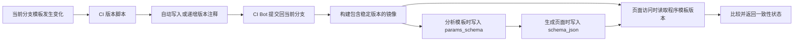

# 页面模板 Git 版本一致性检查方案

## 1. 背景

系统页面由以下三层数据组成：

1. 镜像程序中的 Jinja2 页面模板：`server/templates/pages/*.j2`。
2. SQLite 中的模板定义：`sys_page_templates_config`。
3. SQLite 中由模板生成的活动页面：`sys_page_template`。

当前生成链路为：

```text
程序模板文件
    -> 分析模板
sys_page_templates_config
    -> 配置参数并渲染
sys_page_template.schema_json
    -> GET /api/page/:pageKey
前端页面
```

页面打开时只读取 `sys_page_template.schema_json`，不会检查当前镜像中的模板是否已经更新。因此，现场更新镜像但继续使用旧 SQLite 时，页面仍会正常显示旧版本，很难及时发现。

## 2. 方案目标

本方案需要满足以下目标：

- 模板版本由 Git 和 CI 自动维护，开发人员不填写或计算版本号。
- 版本处理只针对触发 CI 的当前 Git 分支，不直接读取、修改或推送其他分支。
- 未修改的历史模板即使没有版本注释，也保持原状，不强制迁移。
- 历史 SQLite 不增加字段、不修改表结构，可以直接随新镜像继续使用。
- 页面访问不增加对 `sys_page_templates_config` 的查询依赖。
- 页面版本不一致时只提示，不阻断旧页面继续访问。
- 修改公共模板时能够使受影响的页面模板进入新版本。

## 3. 总体设计

版本信息分别放在现有的三个载体中：

| 层级 | 版本载体 | 存储位置 |
| --- | --- | --- |
| 程序模板 | Jinja2 版本注释 | `server/templates/pages/*.j2` |
| 模板定义 | JSON 扩展元数据 | `sys_page_templates_config.params_schema` |
| 生成页面 | AMIS Schema 扩展元数据 | `sys_page_template.schema_json` |

不向 SQLite 表增加版本字段。

完整流程如下：



## 4. 程序模板版本格式

进入版本管理的页面模板在文件顶部包含以下注释：

```jinja2
{# @template-version: 12 #}
```

版本规则：

- 版本为正整数。
- 新进入版本管理的模板从 `1` 开始。
- 模板每次在当前分支发生有效内容变化时增加 `1`。
- 版本注释由 CI 脚本生成和规范化，不由开发人员手工维护。
- 比较模板正文时必须排除版本注释，避免版本提交再次触发版本递增。

没有版本注释的模板属于历史未托管模板。只要当前 Git 分支没有修改它，CI 和运行时都不要求处理。

## 5. 当前分支 Git 处理范围

CI 版本处理仅使用当前分支本次 push 的提交区间：

```text
起始提交：github.event.before
结束提交：github.sha
当前分支：github.ref_name
```

版本工具调用形式：

```bash
node server/scripts/update-template-versions.js \
  --from "${BEFORE_SHA}" \
  --to "${CURRENT_SHA}"
```

脚本通过以下命令确定当前分支本次 push 修改的模板文件：

```bash
git diff --name-only <before> <sha> -- server/templates
```

方案明确禁止以下行为：

- 不使用 `origin/main` 作为版本计算基线。
- 不使用 Pull Request 的目标分支版本覆盖当前分支。
- 不向 PR 目标分支直接提交版本。
- 不读取或修改其他并行开发分支。
- 不在运行时依赖 `.git` 目录。

## 6. 自动版本算法

### 6.1 页面模板直接变化

脚本分别读取起始提交和结束提交中的模板内容，并移除所有版本注释后比较正文：

```js
const contentChanged =
    stripVersionComment(currentContent) !==
    stripVersionComment(previousContent);
```

如果正文没有变化，不处理该模板。

如果正文发生变化：

```js
const previousVersion = readVersion(previousContent) || 0;
const targetVersion = previousVersion + 1;

rewriteWithSingleVersionComment(currentFile, targetVersion);
```

处理结果：

| 起始提交中的状态 | 当前分支正文变化 | CI 结果 |
| --- | --- | --- |
| 无版本 | 否 | 保持无版本，不处理 |
| 无版本 | 是 | 自动写入版本 `1` |
| 版本 `5` | 否 | 保持版本 `5` |
| 版本 `5` | 是 | 自动写入版本 `6` |
| 文件不存在 | 新增模板 | 自动写入版本 `1` |

脚本写版本时应删除当前文件中已有的版本注释，再在固定位置写入一个目标版本。因此，版本唯一性、格式和整数性由脚本本身保证。

### 6.2 公共模板变化

页面模板会通过 `include` 或 `import` 使用以下公共目录：

```text
server/templates/components/
server/templates/base/
```

第一阶段采用保守策略：

> 当前分支本次 push 只要修改 `components/` 或 `base/` 中的任意模板，就处理全部 `pages/*.j2`：已有版本的模板自动递增，无版本模板自动写入版本 `1`。

该策略可能使部分未受影响的页面也需要更新，但不会漏掉公共组件变化。

后续可以解析静态 `include/import`，建立页面模板的反向依赖图，只递增直接或间接受影响的页面模板。

### 6.3 首次推送

新建分支首次 push 时，`github.event.before` 可能为全零 SHA：

```text
0000000000000000000000000000000000000000
```

此时回退到当前提交的第一个父提交：

```bash
git rev-parse "${CURRENT_SHA}^"
```

不能把当前分支中所有无版本历史模板都当成新增模板。只有相对父提交实际发生变化的模板才进入版本处理。

如果当前提交没有父提交，说明是仓库初始提交，此时只处理初始提交实际包含的模板文件。

## 7. CI Bot 持久化

CI 对模板文件的修改必须提交回触发工作流的当前分支，否则生成的版本只存在于临时工作目录，下一次构建会丢失。

工作流执行过程：

1. 开发提交触发第一次工作流。
2. 版本脚本发现模板变化，自动写入版本。
3. CI Bot 将版本修改提交并推送到当前分支。
4. 第一次工作流不继续构建镜像。
5. 默认 `GITHUB_TOKEN` 的推送不会再次触发当前分支工作流。
6. 功能分支到此结束；版本提交已经持久化到当前分支。
7. 模板版本工作流不调用、不修改也不控制 Docker 工作流；功能分支合并到 `main/master` 后，由仓库原有 Docker workflow 按 merge push 正常构建。

示例：

```text
当前分支模板版本 5
    -> 开发提交修改模板正文
    -> CI 自动改成版本 6
    -> CI Bot 提交到当前分支
    -> 功能分支通过 PR 合并 main/master
    -> 仓库原有 Docker workflow 正常构建镜像
```

CI Bot 版本提交建议使用：

```text
chore(templates): update generated template versions
```

推送必须明确指定当前分支：

```bash
git push origin "HEAD:${CURRENT_BRANCH}"
```

不得向固定的 `main`、`master` 或 PR 目标分支推送。

版本提交使用工作流自带的 `GITHUB_TOKEN`，并为工作流授予 `contents: write`。默认 Token 推送产生的提交不会再次触发 GitHub Actions，因此模板版本必须先在当前功能分支持久化，再通过正常 PR/merge 进入 `main/master`。模板版本工作流不依赖也不修改现有 Docker workflow。

## 8. GitHub Actions 参考流程

版本更新工作流只在 `push` 事件执行：

```yaml
name: Template Versions

on:
  push:
    branches:
      - '**'

permissions:
  contents: write

jobs:
  update-template-versions:
    runs-on: ubuntu-latest

    steps:
      - name: Checkout current branch
        uses: actions/checkout@v4
        with:
          ref: ${{ github.ref_name }}
          fetch-depth: 0

      - name: Update template versions
        env:
          BEFORE_SHA: ${{ github.event.before }}
          CURRENT_SHA: ${{ github.sha }}
        run: |
          node server/scripts/update-template-versions.js \
            --from "$BEFORE_SHA" \
            --to "$CURRENT_SHA"

      - name: Detect generated changes
        id: template_versions
        shell: bash
        run: |
          if git diff --quiet -- server/templates; then
            echo "changed=false" >> "$GITHUB_OUTPUT"
          else
            echo "changed=true" >> "$GITHUB_OUTPUT"
          fi

      - name: Commit versions to current branch
        if: steps.template_versions.outputs.changed == 'true'
        env:
          CURRENT_BRANCH: ${{ github.ref_name }}
        run: |
          git config user.name "template-version-bot"
          git config user.email "template-version-bot@users.noreply.github.com"
          git add server/templates
          git commit -m "chore(templates): update generated template versions"
          git push origin "HEAD:$CURRENT_BRANCH"

```

后续测试和镜像构建任务只能在版本脚本没有产生修改时执行：

```yaml
if: steps.template_versions.outputs.changed == 'false'
```

版本更新与镜像构建保持完全独立。现有 Docker workflow 的手动触发参数、分支触发、密钥注入、架构选择和镜像发布逻辑均保持原样；模板版本功能不对其增加前置 Job、条件判断或调度行为。

## 9. CI 异常边界

版本内容问题由脚本自动修复，不应因为以下情况直接让构建失败：

- 未发生 Git 修改的历史模板没有版本注释。
- 当前文件存在旧版本或错误版本。
- 当前文件意外出现多个版本注释。
- 当前文件中的版本不是整数。

只要模板属于当前分支本次 push 的处理范围，脚本都应将其规范化为唯一、正确的整数版本。

CI 只在无法安全完成自动处理时失败，例如：

- 无法获取当前分支的起始提交或结束提交。
- Git 历史不完整，无法读取提交区间。
- 模板文件无法读取、解析或写入。
- 仓库或分支保护规则不允许 `GITHUB_TOKEN` 向当前分支推送。
- 推送时发生 non-fast-forward，当前分支已被并发更新。
- CI Bot 提交后再次运行版本脚本仍产生版本差异，说明脚本不具备幂等性。

## 10. 程序启动版本注册表

后端启动时扫描 `server/templates/pages/*.j2`，读取已经存在的版本注释，建立内存注册表：

```js
{
    policy_demo: {
        templateFile: 'pages/policy_demo.j2',
        version: 12
    },
    credit_indicators: {
        templateFile: 'pages/credit_indicators.j2',
        version: 5
    }
}
```

未包含版本注释的历史模板登记为 `unversioned`，不作为启动错误，也不阻止服务启动。

生产镜像中的模板是不可变文件，版本注册表只需在进程启动时生成一次。运行时不需要 `.git`，也不需要访问 GitHub。

## 11. 模板定义版本

执行“人工智能配置 > 模板定义管理 > 分析”时，将程序模板版本写入现有 `params_schema`：

```json
{
  "type": "object",
  "x-template-meta": {
    "templateId": "policy_demo",
    "version": 12
  },
  "properties": {}
}
```

不增加 `sys_page_templates_config` 字段。

对于没有版本注释的历史程序模板，模板分析继续保持现有行为，不强制写入版本元数据。

## 12. 页面生成版本

生成或更新页面时执行以下检查：

1. 从启动注册表读取程序模板版本。
2. 如果程序模板没有版本，按历史兼容模式继续生成，不进行版本检查。
3. 如果程序模板已有版本，从 `params_schema.x-template-meta` 读取模板定义版本。
4. 模板定义没有版本或版本不一致时，停止生成并提示先重新分析模板。
5. 版本一致时正常渲染 Jinja2 模板。
6. 后端解析渲染结果后，统一向 AMIS Schema 根节点注入版本元数据。
7. 将结果序列化并写入现有 `sys_page_template.schema_json`。

页面版本示例：

```json
{
  "type": "page",
  "x-template-meta": {
    "templateId": "policy_demo",
    "version": 12
  },
  "body": []
}
```

版本由公共渲染逻辑注入，不要求每个页面模板输出版本字段。

## 13. 页面访问检查

页面访问继续使用现有 `sys_page_template` 查询，不需要为了版本检查额外查询 `sys_page_templates_config`。

检查过程：

1. 读取页面的 `source_template_id`。
2. 解析现有 `schema_json`。
3. 读取 `schema_json.x-template-meta`。
4. 从启动注册表读取程序模板版本。
5. 比较程序版本和页面版本。
6. 页面 Schema 继续正常返回，同时通过响应 `meta` 返回版本状态。

状态定义：

| 状态 | 含义 | 用户处理 |
| --- | --- | --- |
| `current` | 程序版本与页面版本一致 | 不提示 |
| `unmanaged` | 页面没有 `source_template_id` | 按手工页面处理，不提示 |
| `unversioned_template` | 程序模板尚未进入版本管理 | 历史兼容，不提示 |
| `legacy_unversioned` | 程序模板已有版本，但历史页面没有版本 | 提示重新分析并保存页面 |
| `page_outdated` | 程序模板版本大于页面版本 | 提示更新页面 |
| `program_version_older` | 程序模板版本小于页面版本 | 提示检查镜像回滚或部署错误 |
| `missing_program_template` | 页面记录了来源模板，但镜像中不存在 | 提示检查模板或镜像 |

比较逻辑：

```js
if (!page.source_template_id) {
    return { status: 'unmanaged' };
}

const programTemplate = templateRegistry.get(page.source_template_id);

if (!programTemplate) {
    return { status: 'missing_program_template' };
}

if (!programTemplate.version) {
    return { status: 'unversioned_template' };
}

const pageVersion = schema['x-template-meta']?.version;

if (!pageVersion) {
    return { status: 'legacy_unversioned' };
}

if (programTemplate.version > pageVersion) {
    return { status: 'page_outdated' };
}

if (programTemplate.version < pageVersion) {
    return { status: 'program_version_older' };
}

return { status: 'current' };
```

## 14. API 响应

保持现有 `data` 页面 Schema 不变，在响应顶层增加 `meta.templateVersion`：

```json
{
  "status": 0,
  "msg": "success",
  "data": {
    "type": "page",
    "x-template-meta": {
      "templateId": "policy_demo",
      "version": 11
    },
    "body": []
  },
  "meta": {
    "templateVersion": {
      "status": "page_outdated",
      "templateId": "policy_demo",
      "programVersion": 12,
      "pageVersion": 11,
      "message": "当前页面由旧版模板生成，请前往人工智能配置更新"
    }
  }
}
```

版本检查失败不能影响原页面返回。无法完成检查时记录后台日志，并按无提示方式继续展示旧页面。

## 15. 前端提示

动态页面加载后读取 `meta.templateVersion`，在页面内容上方显示公共提示。

建议提示规则：

- `current`、`unmanaged`、`unversioned_template`：不显示提示。
- `legacy_unversioned`：提示模板已经进入版本管理，但当前页面是历史无版本页面。
- `page_outdated`：提示当前页面版本低于镜像程序模板版本。
- `program_version_older`：提示现场镜像可能发生回滚，不建议使用旧程序覆盖新页面。
- `missing_program_template`：提示来源模板在当前镜像中缺失。

提示不阻断页面访问，并提供“前往人工智能配置”入口。正常更新步骤为：

1. 在“模板定义管理”中重新分析对应模板。
2. 在“页面管理”中编辑并重新保存对应页面。
3. 再次打开页面，版本状态变为 `current`。

## 16. 历史数据兼容

本方案不执行 SQLite 结构迁移，也不批量回填历史数据。

历史数据处理原则：

- 未修改且没有版本注释的历史程序模板继续以原方式工作。
- 历史模板第一次在某个分支发生修改时，由该分支 CI 自动写入版本 `1`。
- 程序模板有版本而历史页面没有版本时，页面仍然正常展示，只增加更新提示。
- 历史页面完成一次重新保存后自动携带版本，进入后续版本比较。
- 没有 `source_template_id` 的手工页面不参与模板版本管理。
- 不依赖数据库时间、镜像文件时间或历史 SQLite 的迁移执行情况。

该方式实现渐进式接入：只有方案上线后实际发生变化的模板及其页面进入版本管理，未变化的历史页面不会被一次性要求更新。

## 17. 分支并发与合并

每个分支只维护自己的版本变化：

```text
feature-a 修改模板 5 -> 当前分支 CI 写入 6
feature-b 修改模板 5 -> 当前分支 CI 写入 6
```

当两个分支先后合并时，后合并分支可能需要解决模板或版本注释冲突。冲突解决后，合并发生在哪个当前分支，就由该分支后续 push 工作流重新规范化版本。

CI Bot 推送遇到 non-fast-forward 时不得强制推送。工作流应失败或重新拉取当前分支后重新计算，禁止覆盖开发人员刚推送的提交。

受保护分支必须明确允许 GitHub Actions 或指定 GitHub App 以 Bot 身份提交。没有写权限时，版本工作流应停止镜像构建并报告权限问题。

## 18. 实施范围

建议按以下顺序实施：

1. 增加 Git 提交区间解析和模板正文规范化工具。
2. 增加页面模板版本自动写入逻辑。
3. 增加公共模板变化处理规则。
4. 增加当前分支 CI Bot 提交工作流。
5. 增加服务启动模板版本注册表。
6. 修改模板分析流程，将版本写入 `params_schema`。
7. 修改页面生成流程，将版本写入 `schema_json`。
8. 修改页面读取接口，返回版本检查状态。
9. 增加前端公共版本提示组件。
10. 增加自动版本脚本、运行时状态和历史兼容测试。

## 19. 验收标准

- 当前分支未修改的无版本历史模板不会被 CI 改动。
- 当前分支首次修改无版本模板时，CI 自动写入版本 `1`。
- 当前分支再次修改同一模板时，CI 自动递增版本。
- CI Bot 版本提交再次触发工作流时不会重复递增。
- CI Bot 只推送触发工作流的当前分支。
- 公共模板变化不会漏掉相关页面模板版本更新。
- 镜像运行时不依赖 `.git`。
- 现场旧 SQLite 无需增加字段或执行结构迁移。
- 历史页面始终可以继续打开。
- 程序版本高于页面版本时显示更新提示。
- 程序版本低于页面版本时提示镜像可能回滚。
- 页面重新分析并保存后，版本状态恢复为 `current`。
