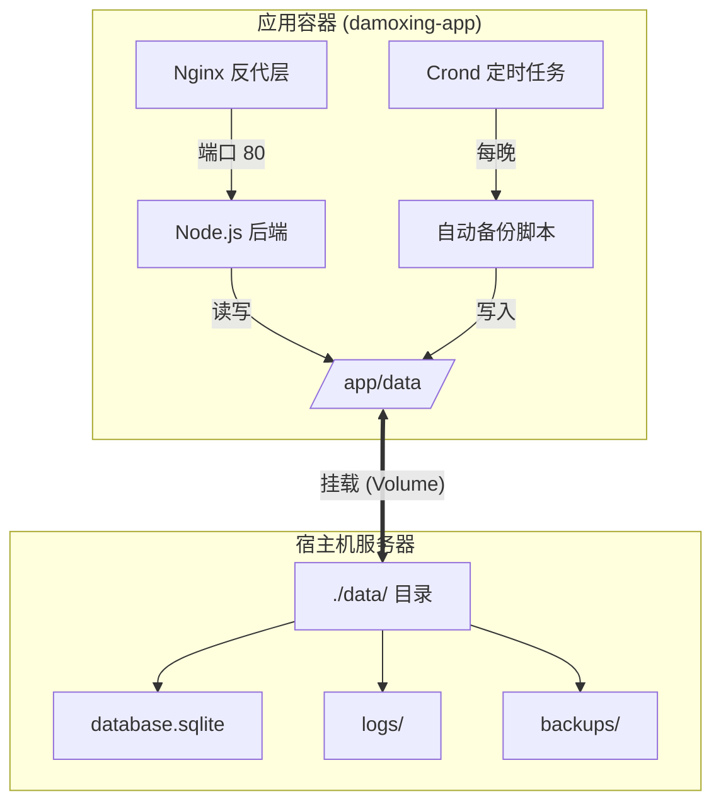

# 📦 综合部署与运维手册 (离线版)

本文档是针对**内网/离线环境**的完整部署指南。手册涵盖了从服务器架构检查、Docker 环境离线安装、镜像导入、项目启动到自动化运维的全生命周期管理。

---

## 🏗️ 1. 架构说明与环境准备

### 1.1 架构支持与检查 (Architecture Support)

本项目容器镜像支持主流的服务器架构。在开始部署前，请务必确认目标服务器的 CPU 架构，以选择正确的安装包。

**检查命令**:
```bash
uname -m
```

| 输出结果 | 架构名称 | 说明 | 适配镜像/文件后缀 |
| :--- | :--- | :--- | :--- |
| `x86_64` | **AMD64** (Intel/AMD) | 绝大多数 PC 和服务器 | `x86_64` 或 `amd64` |
| `aarch64` | **ARM64** (鲲鹏/飞腾/Mac) | 国产信创服务器 | `aarch64` 或 `arm64` |

> ⚠️ **注意**: 请确保下载的 Docker 二进制包和 Docker Compose 文件与服务器架构完全匹配，否则无法运行。

### 1.2 部署架构示意图

本项目采用**单目录挂载**的优化架构，所有持久化数据（数据库、日志、备份）均集中存储，极大简化了运维复杂度。



---

## 🛠️ 2. 离线安装 Docker 环境

如果您的服务器无法访问外网，请按以下步骤安装。

### 2.1 获取离线安装包 (需在有网机器操作)

1.  **Docker Engine**: 访问 [Docker 官方离线包列表](https://download.docker.com/linux/static/stable/)，选择对应的架构目录 (`x86_64` 或 `aarch64`)，下载最新稳定版 `.tgz` 包。
2.  **Docker Compose**: 访问 [GitHub Releases](https://github.com/docker/compose/releases)，下载 `docker-compose-linux-x86_64` 或 `docker-compose-linux-aarch64`。

### 2.2 安装 Docker 引擎

假设安装包已上传至服务器 `/tmp` 目录。

```bash
# 1. 解压安装包
tar -xvf /tmp/docker-*.tgz -C /tmp

# 2. 移入系统路径
sudo cp /tmp/docker/* /usr/bin/

# 3. 配置 Systemd 服务
sudo cat > /etc/systemd/system/docker.service <<EOF
[Unit]
Description=Docker Application Container Engine
Documentation=https://docs.docker.com
After=network-online.target firewalld.service
Wants=network-online.target

[Service]
Type=notify
ExecStart=/usr/bin/dockerd
ExecReload=/bin/kill -s HUP \$MAINPID
LimitNOFILE=infinity
LimitNPROC=infinity
TimeoutStartSec=0
Delegate=yes
KillMode=process
Restart=on-failure
StartLimitBurst=3
StartLimitInterval=60s

[Install]
WantedBy=multi-user.target
EOF

# 4. 启动服务
sudo systemctl daemon-reload
sudo systemctl start docker
sudo systemctl enable docker
```

### 2.3 安装 Docker Compose

```bash
# 1. 移动并重命名 (根据架构选择对应的源文件)
sudo cp /tmp/docker-compose-linux-$(uname -m) /usr/local/bin/docker-compose

# 2. 赋予执行权限
sudo chmod +x /usr/local/bin/docker-compose

# 3. 验证
docker-compose --version
```

---

## 🚀 3. 项目部署流程

### 3.1 准备目录与文件

标准交付包目录结构如下：

```text
/opt/damoxing/
├── damoxing.tar           # 离线镜像包
├── docker-compose.yml     # 编排文件
├── .env                   # 配置文件
└── data/                  # [重要] 唯一的数据目录
    └── database.sqlite    # 初始数据库文件
```

### 3.2 导入离线镜像

```bash
# 导入镜像
docker load -i damoxing.tar

# 验证 (确保看到 damoxing-app 镜像)
docker images
```

### 3.3 修改配置 (.env)

编辑 `.env` 文件，根据现场环境修改关键参数：

```ini
# 服务端口
PORT=3001

# 接口前缀 (例如 /gjjrgzn/api)
API_ROUTE_PREFIX=/gjjrgzn/api

# 跨域白名单 (生产环境建议指定具体域名)
CORS_ORIGIN=*

# 安全密钥 (务必修改为随机字符串)
JWT_SECRET=Change_This_To_A_Random_Secret
```

### 3.4 启动服务

```bash
# 启动
docker-compose up -d

# 查看状态 (应显示 Up (healthy))
docker-compose ps
```

---

## 🔄 4. 自动化运维与维护

系统内置了自动化运维能力，无需人工干预即可保障数据安全。

### 4.1 自动化备份机制

容器内置了 `crond` 服务和备份脚本，默认策略如下：

*   **执行时间**: 每天凌晨 02:00
*   **备份路径**: `./data/backups/`
*   **保留策略**: 自动保留最近 **7 天** 的备份
*   **实现原理**: 使用 SQLite 在线备份指令 (`.backup`)，**不锁表**，不影响业务。

**手动触发备份 (测试用)**:
```bash
docker exec damoxing-app /app/backup-db.sh
```

### 4.2 数据恢复

当需要回滚数据时：

1.  **停止服务**: `docker-compose down`
2.  **替换文件**: 将 `data/backups/` 下的某个备份文件复制并重命名为 `data/database.sqlite`。
3.  **重启服务**: `docker-compose up -d`

### 4.3 数据库升级

软件版本升级时，通常涉及数据库结构的变更。

1.  **替换程序**: 导入新的 Docker 镜像。
2.  **执行 SQL**:
    ```bash
    # 使用容器内的 sqlite3 工具执行更新脚本
    docker exec -i damoxing-app sqlite3 /app/data/database.sqlite < update_v2.0.sql
    ```

---

## 🩺 5. 故障诊断指南 (Troubleshooting)

如果服务无法正常访问，请按以下步骤由浅入深排查。

### 5.1 快速检查清单

1.  **容器活了吗？**
    *   命令: `docker ps`
    *   正常: 状态为 `Up` 且 `(healthy)`。
    *   异常: `Restarting` 或 `Exited` -> 查看日志。

2.  **端口通了吗？**
    *   命令: `netstat -tuln | grep <PORT>`
    *   确保防火墙放行了对应端口。

3.  **日志说什么？**
    *   命令: `docker logs --tail 100 damoxing-app`
    *   关注 `Error` 或 `Exception` 关键词。

### 5.2 常见问题速查

#### Q1: 页面访问 404 或白屏
*   **原因**: 前端静态文件构建失败或 Nginx 配置错误。
*   **排查**:
    ```bash
    # 进入容器查看前端文件是否存在
    docker exec damoxing-app ls -l /usr/share/nginx/html/index.html
    ```

#### Q2: 数据库“Read Only”或“Permission Denied”错误
*   **原因**: 宿主机 `data/` 目录权限不足，容器内无法写入。
*   **解决**:
    ```bash
    # 在宿主机执行
    chmod -R 755 ./data
    # 重启容器
    docker-compose restart
    ```

#### Q3: 登录提示“Network Error”
*   **原因**: `API_ROUTE_PREFIX` 配置与前端请求不一致，或后端未启动。
*   **解决**: 检查 `.env` 中的 `API_ROUTE_PREFIX` 是否与前端构建时的配置一致；检查后端日志。

---

**技术支持**
如遇无法解决的问题，请收集 `./data/logs/` 目录下的所有日志文件并联系技术支持团队。
